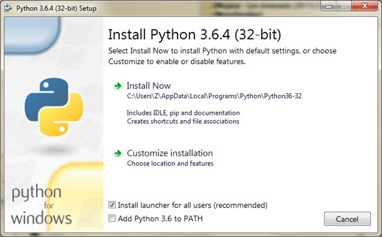
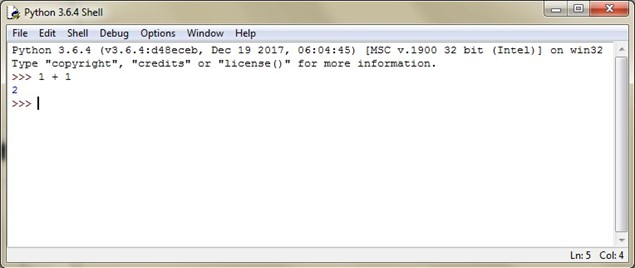
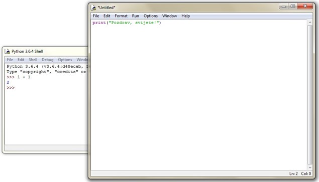
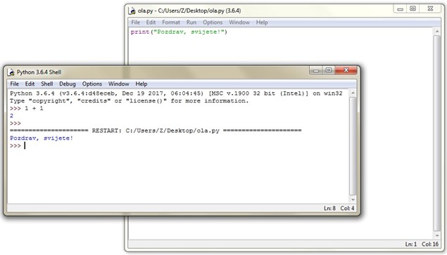
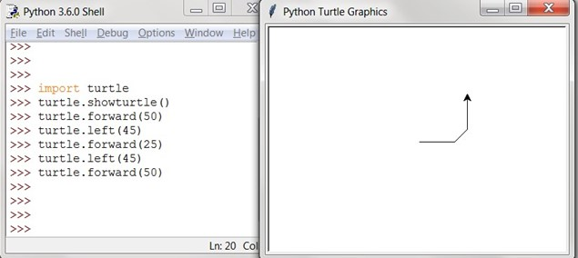
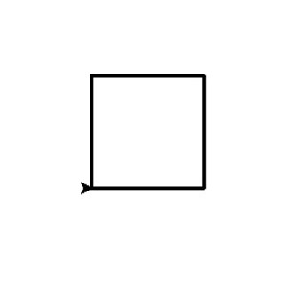
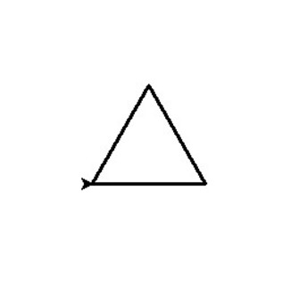
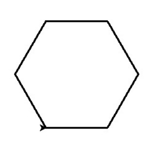
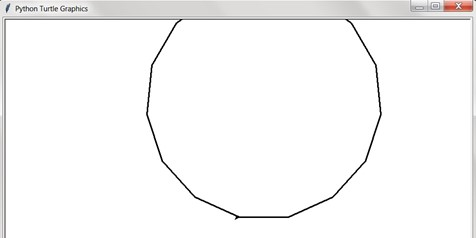
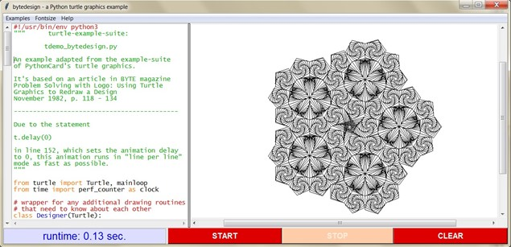

> **Python za informacijske stručnjake**
>
> Krešimir Zauder
>
> 16\. prosinca 2020.
>
> **Sadržaj**

[**I. Prvi susret s programiranjem**
**1**](#prvi-susret-s-programiranjem)

[**1. Uvod u programiranje** **2**](#uvod-u-programiranje)

[1.1. Instalacija Pythona 4](#instalacija-pythona)

[1.1.1. Instalacija na Windows OS-u 4](#instalacija-na-windows-os-u)

[1.2. Pisanje i izvršavanje Python kôda
5](#pisanje-i-izvršavanje-python-kôda)

[1.3. Primjeri 8](#primjeri)

[1.4. Moj prvi program 9](#moj-prvi-program)

[1.4.1. Moja prva pogreška 13](#moja-prva-pogreška)

[1.5. Osnovni koncepti i pojmovi 17](#osnovni-koncepti-i-pojmovi)

[1.5.1. Što je to „programski jezik"? 17](#što-je-to-programski-jezik)

[1.5.2. Razine programskih jezika i izvršavanje kôda
18](#razine-programskih-jezika-i-izvršavanje-kôda)

[1.5.3. Namjena programskih jezika 19](#namjena-programskih-jezika)

[1.5.4. Softver, programi, aplikacije, skripte
19](#softver-programi-aplikacije-skripte-...)

[1.5.5. Sastavni dijelovi programskog kôda
20](#sastavni-dijelovi-programskog-kôda)

[1.6. *Notepad* na stereoidima! ili U čemu pisati Python kôd?
21](#notepad-na-stereoidima-ili-u-čemu-pisati-python-kôd)

[1.7. Možda vrijedi znati i 22](#možda-vrijedi-znati-i-...)

[1.7.1. Neke korisne distribucije za Windows OS
22](#neke-korisne-distribucije-za-windows-os)

[1.7.2. Python 2 i 3 22](#python-2-i-3)

[**2. Radnje: Izjave, izrazi, operatori, funkcije i metode**
**24**](#radnje-izjave-izrazi-operatori-funkcije-i-metode)

[2.1. Izjave i izrazi 24](#izjave-i-izrazi)

[2.2. Operatori 26](#operatori)

[2.2.1. Pridruživanje vrijednosti varijabli
26](#pridruživanje-vrijednosti-varijabli)

[2.2.2. Aritmetički operatori 27](#aritmetički-operatori)

[2.2.3. Operatori za usporedbu 28](#operatori-za-usporedbu)

[2.2.4. Logički operatori 28](#logički-operatori)

[2.2.5. Operatori za provjeru članstva
28](#operatori-za-provjeru-članstva)

[2.2.6. Operatori za provjeru identiteta
29](#operatori-za-provjeru-identiteta)

[2.2.7. Prioritet izvršavanja operacija
30](#prioritet-izvršavanja-operacija)

[2.3. Funkcije i metode 31](#funkcije-i-metode)

[2.3.1. Pozivanje i parametri 32](#pozivanje-i-parametri)

[2.3.2. Interna dokumentacija i funkcija help
33](#interna-dokumentacija-i-funkcija-help)

[2.3.3. Metode 35](#metode)

[**3. Podaci: Vrijednosti i njihove vrste**
**37**](#podaci-vrijednosti-i-njihove-vrste)

[3.1. Brojevi 38](#brojevi)

[3.2. Booleove vrijednosti 39](#booleove-vrijednosti)

[3.2.1. Usporedba brojeva 39](#usporedba-brojeva)

[3.2.2. Usporedba drugih vrsta vrijednosti
41](#usporedba-drugih-vrsta-vrijednosti)

[3.2.3. Koje vrijednosti postoje? 42](#koje-vrijednosti-postoje)

[3.2.4. Booleovi operatori 42](#booleovi-operatori)

[3.3. None 43](#none)

[**4. Moduli: Proširenja mogućnosti**
**45**](#moduli-proširenja-mogućnosti)

[4.1. Standardna knjižnica 47](#standardna-knjižnica)

[4.2. Instalacija dodatnih modula 48](#instalacija-dodatnih-modula)

[**5. Kontrola toka: Kondicionali, petlje i pokušaji**
**49**](#kontrola-toka-kondicionali-petlje-i-pokušaji)

[5.1. Kondicionali: Ako \... onda 49](#kondicionali-ako-...-onda-...)

[5.2. Petlje: ponavljanje naredbi 52](#petlje-ponavljanje-naredbi)

[5.2.1. Za svaki 53](#za-svaki)

[5.2.2. Dok se uvjet ne zadovolji 55](#dok-se-uvjet-ne-zadovolji)

[5.2.3. Prekini petlju 56](#prekini-petlju)

[5.2.4. Preskoči korak u petlji 58](#preskoči-korak-u-petlji)

[5.3. Pogreške i pokušaji 59](#pogreške-i-pokušaji)

[5.4. Korištenje više mehanizama kontrole toka
63](#korištenje-više-mehanizama-kontrole-toka)

[**6. Primjeri** **66**](#primjeri-1)

[6.1. Programiranje s kornjačom 66](#programiranje-s-kornjačom)

[6.2. Kalkulator 75](#kalkulator)

[6.3. Pogodi broj 84](#pogodi-broj)

> i

ii

> **Dio I.**

Prvi susret s programiranjem 
=============================

1. Uvod u programiranje
=======================

Kada bi pisanim jezikom znali zadavati naredbe računalu, mogli bi mu
naređivati da kontinuirano izvršava naše „recepte". Mogli bi
automatizirati razne zadatke! To je programiranje: zadavanje naredbi
računalu putem jezika koji je osmišljen baš za tu svrhu. Obzirom da su
računala vrlo efikasna u obavljanju dosadnih i repetitivnih radnji i da
to rade brzo i precizno, to je vrlo korisna

vještina.

Programiranje je, međutim, puno više od samo automatizacije poznatih nam
procesa. Takvim razmišljanjem stvaramo i uvjete za nove ideje i
mogućnosti. Možemo osmisliti potpuno nove pristupe raznim problemima. Na
ovaj način je, na primjer, nastao softver s grafičkim sučeljem koji nam
omogućuje zadavanje naredbi računalu kroz vizualne metafore radije nego
kroz tekstualne naredbe. Danas nam gotovo više nije moguće zamisliti rad
sa računalima bez ove inovacije, ali u početku to nije bila nimalo
jednostavna zamisao. Također, ovako su nastali Internet i World Wide
Web, precizniji medicinski aparati, računalne igre, algoritmi koji uče,
umjetna inteligencija, mogućnost programiranja satelita u svemiru i
robota koji istražuju Mars te mnogi drugi sustavi koji nas danas
okružuju te nam pomažu i zabavljaju nas. Ovako su nastali i računalni
virusi i ostali maliciozni softver, kontrola i krađa informacija,
utjecaj na ljudske odluke i opredjeljenja na daleko većoj i suptilnijoj
razini no ikad prije, kibernetičko ratovanje te kojekakve druge
opasnosti i nepoznatosti. Ovako su nastali Google, Facebook, Amazon i
druge gigantske web korporacije koje donose mnoge korisne usluge, ali i
počinju kontrolirati sve veću količinu informacija. Ovako nastaje sve
što su ljudi sposobni osmisliti, a može se provesti putem zadavanja
naredbi umreženim računalima\...

Ipak, ovaj tekst se ne tiče šireg utjecaja korištenja računala na gotovo
sve sfere ljudske djelatnosti već na osnove upravljanja računalom putem
programskih jezika pa ćemo se fokusirati samo na to. Važno je samo
držati na umu koliko toga je moguće postići programiranjem jer se
prilikom učenja osnova na tu činjenicu može lako zaboraviti. Za
usporedbu nam može poslužiti matematika. Dok tek učimo osnovne
aritmetičke račune lako je propustiti koliki značaj matematika ima u
arhitekturi, fizici, glazbi i mnogim drugim sferama ljudske djelatnosti.

U svakom slučaju, danas smo do te mjere okruženi raznim grafičkim
sučeljima da je često teško zamisliti što možemo s programiranjem izvan
konteksta razvoja takvog softvera. Programiranje je drugi način
komunikacije koji se temelji na formalnim jezicima i formiranju procesa
koji računalo na zahtjev može izvršiti bilo koji broj puta. Kao
praktična vještina, programiranje nam omogućuje automatizaciju
kojekakvih radnih zadataka, a izrada aplikacija s grafičkim sučeljem je
samo jedan vid korištenja ove vještine. Kao teorijsko znanje,
programiranje nam omogućava bolji uvid u rad računala i suvremenih
informacijskih sustava, ali i u formalne načine upravljanja putem
strukturiranih podataka.

O terminologiji ćemo kasnije, ali recimo za sada da zapis naredbi
izrečenih nekim programskim jezikom, odnosno skup programskih
instrukcija, nazivamo „programskim kôdom" što se često jednostavno
skraćuje u „kôd"[^1]. Kako bismo počeli programirati, moramo odabrati
neki programski jezik koji propisuje *sintaksu* za pisanje kôda. Taj
jezik nam omogućuje da razgovaramo s računalom. Sintaksa je skup pravila
koji propisuje kako ispravno formirati neki prirodni ili umjetan jezik,
odnosno koje rečenice izrečene jezikom su ispravne, a koje nisu.

> Za potrebe ovog teksta odabran je programski jezik **Python**, ali
> većina prikazanih koncepata i mehanizama tvore osnovu razumijevanja
> programiranja koja je primjenjiva u gotovo bilo kojem suvremenom
> programskom jeziku. Kada se nauči jedan programski jezik, mnogi
> osnovni koncepti ostaju isti i u drugima.
>
> Python je popularan programski jezik vrlo *visoke razine*[^2] i
> *općenite namjene* koji je dostupan za sve danas popularne operativne
> sustave. Neke prednosti ovog programskog jezika i razlozi radi kojih
> se često uči kao prvi programski jezik su sljedeći:

-   **Brzo postizanje rezultata i brzo usvajanje jezika**: napisati
    program koji radi nešto korisno zahtijeva manje posla nego u većini
    drugih jezika. Također, Python se brzo uči i često navodi kao
    izvrstan jezik za prvi susret s programiranjem. Ipak, za razliku od
    mnogih drugih „početničkih" jezika, Python je koristan i
    profesionalcima.

-   **Čitljiv kôd**: sintaksa je dizajnirana s naglaskom na čitljivost.
    Python kôd je sličan engleskom jeziku te sadrži manje posebnih
    znakova (poput vitičastih zagrada i točka-zareza) od većine drugih
    jezika.

-   **Više-paradigmatski pristup**: Python dopušta proceduralno,
    objektno i funkcijsko programiranje. U njemu možemo napisati
    jednostavnu skriptu, ali i kompleksan program s grafičkim sučeljem
    ili web aplikaciju.

-   **Baterije uključene**: Python dolazi s velikom zbirkom *standardnih
    modula* koji proširuju jezik s vrlo korisnim i često potrebnim
    mogućnostima (na primjer čitanje i zapis posebnih formata, rad s
    datotekama i operativnim sustavom, slanje elektroničke pošte, rad s
    WWW tehnologijama \...). Drugim riječima, mnoge programski
    naprednije radnje su već uključene u samu instalaciju ovog
    programskog jezika.

-   **Aktivna zajednica**: Python je vrlo popularan i za mnogo toga se
    aktivno koristi. Radi toga postoji velik broj kvalitetnih proširenja
    mogućnosti ovog programskog jezika (i.e. modula) koji se aktivno
    razvijaju. Drugim riječima, u posebnim slučajevima (poput rada sa
    slikama i drugom multimedijom ili statističkim podacima) postoji već
    velik broj kvalitetnih proširenja koji nam olakšavaju rad. Također,
    lako je pronaći pomoć i dobiti podršku za česte probleme.

1.1. Instalacija Pythona
------------------------

Python programski kôd možemo pisati na papiru pa čak i na zidu pećine i
to bi još uvijek bio jezik Python. Ipak, kako bismo kôd pisan u Pythonu
*izvršili* potrebno ga je zapisati kao računalni tekst. Taj tekst se
zatim putem posebnog programa prevodi u drugu vrstu kôda koji je
računalu moguće direktno provesti, a ljudima nije čitljiv. O detaljima
ćemo kasnije, ali recimo za sada da je taj poseban program koji prevodi
Python u instrukcije izvršive računalu sama *implementacija* programskog
jezika i da ga je potrebno instalirati kako bismo mogli izvršavati
naredbe napisane u tom programskom jeziku.

Obzirom da je implementacija Pythona računalni program, a i sama
definicija jezika se razvija dodavanjem i zastarijevanjem koncepata,
Python razvojem dobiva različite verzije. Minimalna pretpostavljena
verzija Pythona za potrebe ovog teksta je 3.3., a preporuča se
instalirati zadnju 3.x

verziju.

#### Važno: Koristite Python 3

> Ova skripta nije namijenjena za Python 2.x i mnogi primjeri u toj
> verziji neće raditi ili će raditi pogrešno.

U trenutku pisanja ovog teksta, Python 2 još uvijek na nekim operativnim
sustavima (MacOS te razne Linux distribucije) dolazi unaprijed
instaliran, ali se može smatrati zastarjelim i ta verzija Pythona se
koristi samo kako bi se održala kompatibilnost sa starijim sustavima
koji još nisu prerađeni u noviju verziju. Provjerite dakle da je Python
koji pokrećete Python 3, a ne 2.

Kada se Python instalira kroz standardni postupak (tj. registrira se u
operativnom sustavu), Python datoteke postaju *izvršive*, odnosno mogu
se direktno pokretati kao programi. Na primjer, „duplim klikom" ili u
sistemskoj komandnoj liniji. Python datoteke prepoznajemo po tome što im
je nastavak „.py", ali su te datoteke zapravo obične tekstualne datoteke
i tipičan nastavak bi im bio „.txt". Nastavak „.py" jednostavno
naznačuje da se u njima ne nalazi slobodan tekst već tekst napisan u
jeziku Python. Također, uz instalaciju Pythona dolaze i popratne
komponente poput programa za interaktivno izvršavanje programskih
naredbi, dokumentacije i raznih dodatnih proširenja mogućnosti ovog
jezika.

Operativni sustav (OS) Windows ne uključuje instalaciju Pythona već ga
je potrebno dodatno instalirati. Opis instalacije za Windows OS je u
nastavku. Što se tiče raznih Linux distribucija i MacOS-a, Python je
često unaprijed instaliran, ali treba provjeriti verziju te instalirati
Python 3.x ukoliko je potrebno. Upute za instalaciju za MacOS i Linux
distribucije možete pronaći na [python.org.](http://www.python.org/)

### 1.1.1. Instalacija na Windows OS-u

Standardna instalacija na Windows OS-u se obavlja putem „instalera"
referentne implementacije Pythona s
[python.org.](http://www.python.org/) Python instaliran na ovaj način
dolazi sa svim standardnim dijelovima jezika i jednostavno ga je
instalirati putem uobičajenog grafičkog sučelja za instalaciju *desktop*
aplikacija. Na slici 1 vidimo kako izgleda pokretanje instalacije
novijih verzija Pythona.

> Slika 1: Instalacija Pythona na Windows OS-u
>
> {width="6.6142760279965005in"
> height="4.104741907261593in"}
>
> Dok klik na „Install Now" obavlja većinu posla, ipak je korisno
> primijetiti neke detalje i uključiti dodatne mogućnosti. Python će se
> po zadanim postavkama instalirati u korisnički direktorij (na slici je
> instalacija za korisnika koji se zove Z) i to u pod-direktorij
> „AppData\\Local\\Programs\\Python". Ovo je zgodno zapamtiti jer katkad
> treba pronaći instalaciju Pythona na disku. Glavni razlog za to je
> instalacija proširenja (koja se u Pythonu nazivaju „moduli") za ovaj
> programski jezik. U ovom smislu je vrlo korisna i mogućnost **Add
> Python 3.x to PATH** koja po zadanim postavkama nije uključena, ali
> dobro ju je uključiti. Tada nakon instalacije možemo Python alate
> koristiti iz bilo kojeg direktorija, što je posebno korisno za
> instalaciju dodatnih modula, odnosno proširenja mogućnosti ovog
> programskog jezika.

1.2. Pisanje i izvršavanje Python kôda
--------------------------------------

> Kao što smo već rekli, manji Python program nije ništa drugo nego
> jedna obična tekstualna datoteka s instrukcijama napisanim u jeziku
> Python i s ekstenzijom „.py" radije nego „.txt". Ovo više manje stoji
> za sve programske jezike, osim što drugi koriste vlastite ekstenzije.
> Python datoteke s nastavkom .py može izvršavati direktno bez dodatnih
> korisničkih koraka. Drugim riječima, .py datoteke možemo jednostavno
> pokrenuti klikom miša ili unosom u komandnu liniju. Kod drugih vrsta
> jezika moramo prvo automatski prevesti tekstualne datoteke koje sadrže
> instrukcije u binarne datoteke koje su izvršive (kao što su to .exe
> datoteke).

Drugi način izvršavanja Python kôda je unosom u Python komandnu liniju.
Ova komandna linija nije isto što i komandna linija operativnog sustava
jer izvršava Python kôd radije no sistemske naredbe. Python komandna
linija je vrlo korisna za učenje i testiranje kôda, a iskusni programeri
je koriste i za jednostavnije administrativne ili analitičke zadatke.
Nije međutim podobna za pisanje programa koje planiramo izvršiti veći
broj puta ili obavljanje kompleksnijih radnji. Ova mogućnost nije toliko
univerzalna među programskim jezicima kao što je to zapis programa u
tekstualne datoteke. Ipak, ova komandna linija nam **omogućava direktnu
eksperimentaciju** i jedna od prednosti Pythona i to posebno za potrebe
učenja programiranja. Ovu mogućnost valja, dakle, često koristiti!

Standardna instalacija Pythona dolazi s programom „IDLE" koji pruža
jednostavno grafičko sučelje za direktno izvršavanje kôda. Nakon što smo
instalirali Python, pokrenimo program IDLE kako bismo krenuli izvršavati
programske naredbe jer je ovo u početku vrlo korisno za upoznavanje
koncepata i eksperimentaciju s mogućnostima. IDLE se ponaša kao i većina
aplikacija s grafičkim sučeljem, odnosno moguće ju je pokrenuti kroz
*Start menu* ili ekvivalente u drugim operativnim sustavima.

> Slika 2: Izvršavanje Python kôda putem sučelja IDLE

{width="6.614410542432196in"
height="2.7877482502187227in"}

Kada pokrenemo IDLE, dočekati će nas glavno sučelje ovog programa koje
je prikazano na slici 2. U glavnom prozoru IDLE-a naredbe se upisuju
nakon redaka koje počinju s „*~\>\>\>~*", a izvršavaju pritiskom na
tipku *enter* odnosno *return*. U ovom slučaju smo izvršili jednostavan
*izraz* ~1\ +\ 1~. Kada se taj izraz evaluira pritiskom na tipku
*enter*, rezultat se ispisuje u idućem retku koja ne započinje s
„*~\>\>\>~*" kako bi bilo jasno da se radi o rezultatu, a ne o naredbi.
Obzirom da još nismo spomenuli niti jednu posebnu naredbu za programske
jezike, probajte izvesti nekoliko osnovnih matematičkih radnji. IDLE je
sam po sebi sjajan kao kalkulator, a dobiti ćete dojam kako ovakvo
sučelje funkcionira. Nemojte se uplašiti ukoliko vam se ne ekran ispišu
crvena slova koja javljaju grešku, to je normalno.

> Osim same komandne linije, IDLE funkcionira i kao program za izradu
> tekstualnih datoteka odnosno omogućuje i standardan pristup
> programiranju. Ako iz padajućeg izbornika odaberemo mogućnost
> „File-\>New File", otvoriti će nam se nova tekstualna datoteka kao što
> je vidljivo na slici 3. Datoteka sadrži tipičan program za prvi susret
> s programiranjem koji ćemo kasnije podrobnije analizirati.
>
> Slika 3: IDLE i pisanje tekstualnih datoteka
>
> {width="6.61428258967629in"
> height="3.7786067366579177in"}
>
> Novi prozor koji nam se otvorio je jednostavan program za pisanje
> tekstualnih datoteka (poput Notepada i sličnog softvera), a ne
> komandna linija kao glavni prozor IDLE-a. U novonastalu datoteku
> možemo upisati bilo koji program i zatim ga izvršiti putem mogućnosti
> iz padajućeg izbornika „Run\>Run Module" ili pritiskom na tipku „F5".
> Jedini zahtjev je da prvo sačuvamo datoteku na disk pri čemu je dobro
> paziti da joj dodijelimo ekstenziju .py. IDLE kao softver je, naime,
> dosta asketske prirode pa neke verzije ne paze na to umjesto nas.
> Rezultat ove radnje je vidljiv na slici 4.
>
> Upravo smo izvršili računalni program! Ovu datoteku nismo morali
> pokretati kroz IDLE, mogli smo je i jednostavno pokrenuti direktno iz
> operativnog sustava. Ipak, prije no što se bacimo na samo
> programiranje recimo nešto o primjerima u ovom tekstu jer ih ubuduće
> nećemo više prikazivati kroz slike softvera s grafičkim sučeljem već
> kao programski kôd.
>
> Slika 4: IDLE i rezultat izvršavanja programa

{width="6.614326334208224in"
height="3.784557086614173in"}

1.3. Primjeri
-------------

Obzirom da se radi o programiranju, ovaj tekst je prepun primjera.
Primjeri su posebno označeni kako bi bilo jasno da se radi o kôdu,
radije nego o slobodnom tekstu. Na primjer:

Ovakvi primjeri su najčešći i prikazuju dio Python koda kakav bi se
nalazio u nekoj .py datoteci. Ove datoteke je najbolje za početak pisati
u softveru koji nam je jednostavno koristiti pa kasnije potencijalno
preći na profesionalniji softver za programiranje. Za upoznavanje s
ovakvim softverom i odabir aplikacije za pisanje kôda vidi poglavlje
1.6, a za sada se zadržimo na primjerima u ovom tekstu.

#### Važno: Primjeri

> U ovoj tekstu primjeri su neobično važni jer se upravo unutar primjera
> često prenose novi koncepti i mogućnosti tako da ih je vrlo važno sve
> pročitati i dobro razumjeti jer kasniji primjeri zahtijevaju da su
> raniji koncepti već usvojeni.
>
> Osim spomenute vrste primjera, postoji još jedna:
>
> Primjeri u kojima neki reci počinju s „*~\>\>\>~*" su česti u Python
> literaturi i označavaju da se radi o interaktivnom izvršavanju kôda
> kojeg je korisnik unio u komandnu liniju kao što smo prikazali ranije.
> Na ovaj način se često prikazuju osnovni koncepti, a pojava ovakvog
> primjera naznačuje da s prikazanim treba eksperimentirati u Python
> komandnoj liniji (npr. IDLE-u) kako bi bolje usvojili prikazane
> koncepte i mehanizme.
>
> Riječ je o mogućnosti Pythona da se kôd upisuje i izvršava redak po
> redak što je izvrsno za učenje jezika jer omogućava direktnu
> eksperimentaciju. Reci koji počinju s „*~\>\>\>~*" su oni koje mi
> upisujemo u Python komandnu liniju, a reci bez tih znakova se mogu
> pojaviti samo nakon redaka s početnim „*~\>\>\>~*" i prikazuju
> rezultat izvršavanja prijašnjeg retka, ako postoji. Naravno, znakovi
> „*~\>\>\>~*" nisu dio kôda već jednostavno naznaka gdje se nalazi
> početak linije koja se izvršila. Drugim riječima, njih ne prepisujemo
> kada želimo isprobati kôd!
>
> U svakom slučaju, ovakva mogućnost direktnog izvršavanja kôda je
> izvrsna za učenje programiranja i eksperimentiranje pa je topla
> preporuka koristiti ju čim više. Kada god niste sigurni kako nešto
> funkcionira i koji je rezultat ili vrsta rezultata određenog izraza,
> eksperimentirajte s time u Python komandnoj liniji.
>
> Vrijedi napomenuti i da primjeri iz komandne linije prikazuju kôd koji
> nije nužno međusobno povezan među recima, dok je to kod primjera iz
> datoteka uvijek slučaj.

1.4. Moj prvi program
---------------------

> Rekli smo već da se s Pythonom brzo postižu rezultati pa umjesto
> teorije krenimo s implementacijom tradicionalnog programa za prvi
> susret s programiranjem, a obzirom da radimo u vrlo čitljivom i
> produktivnom programskom jeziku, odvesti ćemo ovaj program i korak
> dalje! Svi spomenuti koncepti u ovom poglavlju su pobliže objašnjeni
> kasnije u skripti.

Napravite novu tekstualnu datoteku s nazivom „pozdrav\_svijetu.py".
Jedan način za ovo je odabir mogućnosti „File \> New File" u programu
IDLE. Pa zatim „File \> Save" u novom prozoru kada ispunimo datoteku.
Sadržaj datoteke treba biti sljedeći:

Ova datoteka je *računalni program* koji ispisuje „Pozdrav, svijete!" na
ekran. Prikazani program nije posebno uzbudljiv, ali ga možemo smatrati
kompletnom aplikacijom[^3]. Ekstenzija „.py" označava da se radi o
Python kôdu. Ako je Python instaliran na sustavu, ova datoteka se može
pokrenuti kao *izvršiva* datoteka. Drugim riječima, dupli klik na ovu
datoteku (ili unos u komandnu liniju) i ovaj program će ispisati
„Pozdrav, svijete!" na ekran i završiti izvršavanje programa. Ako se
sustav umjesto toga požali na nepoznatu ekstenziju, znači da Python nije
pravilno instaliran odnosno da nije registriran u operativnom sustavu.

Ako pak na pokretanje datoteke samo neki prozor bljesne na ekranu i
odmah se zatvori ili se naoko ništa ne dogodi, šanse su da se program
ispravno izvršio. Naime, početnicima je čest problem vidjeti rezultate
ovog programa jer se rezultat ispisuje u komandnu liniju, a taj prozor
se uglavnom zatvori čim program završi. Za ovo je kriv operativni sustav
koji komandnu liniju zatvori čim je program gotov s izvršavanjem. Jedan
od načina na koji možemo riješiti problem je da dodamo još jednu naredbu
u naš program koja računalu govori da pričeka neki naš unos prije no što
se završi izvršavanje.

Otvorite „pozdrav\_svijetu.py" i promijenite sadržaj u:

Probajmo sada pokrenuti „pozdrav\_svijetu.py" duplim klikom na datoteku.
Vježba je uspješna ako vidimo ekran na kojem su ispisana dva retka
teksta („Pozdrav, svijete!" i „Pritisni \<enter\> za kraj") koji se se
zatvara (ili vraća u komandnu liniju) kad pritisnemo tipku *enter*. Sad
smo već i doradili naš program kako bi zaobišli određene osebujnosti
operativnog sustava. Ako program još uvijek ne radi, šanse su da smo
negdje učinili pogrešku u sintaksi pa provjerite da su zagrade i
navodnici ispravno zatvoreni.

Općenito rečeno, računalni program je sustav *računalu izvršivih
naredbi*. Te naredbe rade na temelju specificiranih podataka jer
**računalo može raditi samo s podacima**. Posljedice slanja tih podataka
određenom hardveru (ekstremniji primjeri bi bili nuklearna elektrana ili
satelit u svemiru) mogu itekako imati utjecaja na stvarni svijet, ali
računalni programi interno rade samo s podacima. Možemo pojednostavljeno
reći da se računalni programi sastoje od *radnji* i od *podataka*.
Zapravo i sam zapis programa možemo smatrati podacima[^4], ali biti će
nam lakše početi programirati ako razlikujemo dijelova kôda koji
*prenose instrukcije* odnosno koje *reprezentiraju radnje* i dijelove
kôda koji *prenose informacije*, odnosno koji jednostavno
*reprezentiraju podatke*.

> Pogledajmo kako to funkcionira u programu koji smo upravo napisali. U
> našem programu, prva naredba se sastoji od poziva na *funkciju*
> **~print~** s vrijednošću ~\'Pozdrav,\ svijete!\'~ kao *parametrom*
> što zajedno tvori jedan *izraz*: ispiši
> ~\'Pozdrav,\ svijete!\'\ na\ ekran~. Ovaj izraz se sastoji od poziva
> na jednu radnju i svih podataka potrebnih za izvršavanje te radnje. Ti
> podaci su u ovom slučaju jednostavno tekst koji treba ispisati, a
> radnja se provodi pozivom na funkciju. Druga naredba se, na isti
> način, sastoji od poziva na funkciju input s vrijednošću \'Pritisni
> \<enter\> za kraj\'. Funkciju ovdje možemo shvatiti kao „naredbu
> računalu" radije no u striktno matematičkom smislu, a *poziv na
> funkciju* je naredba da se funkcija izvrši. Funkcija je jedan od
> temeljnih načina na koji u suvremenim programskim jezicima zadajemo
> radnje koje računalo treba izvršiti. Možemo reći da osnovne radnje
> „pakiramo" u funkcije što nam omogućuje da izvršavamo kompleksnije
> radnje kroz jednu naredbu. **~print~** je najosnovnija funkcija za
> izvještavanje korisnika o rezultatima programa ili o važnim
> informacijama za vrijeme izvršavanja programa, a ~input~ je
> najosnovnija funkcija koja korisniku omogućuje unos vrijednosti u
> program. Drugim riječima, ~input~ i **~print~** su osnovne
> *input/output* naredbe u Pythonu. Obje funkcioniraju kroz komandnu
> liniju jer bilo kakvo grafičko sučelje unosi dodatne komplikacije u
> program i zahtjeve za operativni sustav. Programiranje grafičkog
> sučelja za ovaj program bi, na primjer, bilo znatno kompleksnije za
> izvesti od onoga što program već radi.
>
> U našem programu, funkciju ~input~ koristimo samo za zadršku programa
> od zatvaranja prije no što smo stigli pročitati informacije koje nam
> je program ispisao. Ovo je zapravo trik koji koristimo kako nam
> operativni sustav ne bi zatvorio prozor prije no što pročitamo
> rezultate programa. U idućoj vježbi je prikazano kako se ~input~
> uobičajeno koristi.
>
> Otvorite „pozdrav\_svijetu.py" i promijenite sadržaj u kôd prikazan u
> primjeru 1.9, a zatim pokrenite program i pratite upute na ekranu.

U ovom zadatku, pojavljuju se novi koncepti, *komentar* i *varijabla*.

Komentari se naznačuju znakom ~\#~ i sav tekst nakon tog znaka se smatra
slobodnim tekstom koji se ne izvršava, a ne programskim kôdom. Znak ~\#~
se može pojaviti bilo na početku ili unutar retka. Komentari služe
pružanju dodatnih informacija o kôdu i vrlo su korisni za poboljšanje
čitljivosti i planiranje programa. U kompleksnom kôdu, na primjer,
korisno je napisati riječima što se u nekom dijelu odvija kako bi se
olakšao razvoj i kasnije preinake. Prilikom razvoja, često je korisno i
prvo slobodnim jezikom napisati što se sve mora gdje odvijati pa tek
zatim, kad struktura i logika programa postane jasna, isprogramirati sam
programski kôd.

#### Važno: Komentari

> Kôd je korisno komentirati i preporuča se bogato korištenje komentara.
> Na taj način se mogu pružiti dodatna objašnjenja koja služe boljem
> razumijevanju kôda. Također, vrlo su korisni kada čitamo tuđi kôd ili
> se vratimo na vlastiti kôd koji smo napisali ranije pa zatim nismo
> neko vrijeme radili na njemu.
>
> U ovom tekstu komentari u primjerima su vrlo važni jer objašnjavaju
> kôd, podsjećaju na ranije spoznaje pa čak i uvode nove koncepte.

Obratite, dakle, pažnju na komentare u primjerima jer se njima skreće
pažnja na važne ili nove koncepte. Kraći komentari koji se odnose na
jedan redak kôda se pišu u istom retku nakon samog kôda. Duži komentari
se najčešće pišu u redak iznad samog kôda te se nakon njih ne ostavlja
prazan redak. Ukoliko je komentar predugačak za redak kôda[^5], tada se
komentar može podijeliti u više redaka, a svaku je potrebno započeti
znakom ~\#~.

Varijable možemo shvatiti kao nazive koji stoje za druge vrijednosti. Te
vrijednosti su programeru najčešće nepoznate u trenutku pisanja kôda i
mogu se promijeniti za vrijeme izvršavanja programa.

Varijable su nam nužno potrebne kako bi se mogli referirati na razne
podatke koji su rezultati radnji u programu, koje si unijeli korisnici
ili koji su pak dohvaćeni iz vanjskih datoteka, baza podataka ili raznih
*online* usluga. U primjeru 1.9, ~text~ je varijabla. To možemo
prepoznati ponajprije zato zato jer joj se u retku text = input(\"Unesi
tekst i pritisni \<enter\>: \") *pridružuje* vrijednost. Naime, znak ~=~
je *operator* za pridruživanje vrijednosti varijabli. Uz funkcije,
operatori (npr. ~+~ i ~-~) su drugi osnovan način zadavanja specifičnih
radnji s podacima. Pridruživanje vrijednost varijablama te izvršavanje
radnji putem funkcija i operatora je podrobnije opisano u idućem
poglavlju, kao i njihova povezanost sa širim konceptima *izjava* i
*izraza*. Ono što vrijedi spomenuti odmah su pravila imenovanja
varijabli, funkcija i ostalih elemenata koji imaju specifična imena.

> Tekst \'Unesi tekst i pritisni \<enter\>: \' ili broj 1 su
> vrijednosti, ne stoje za nešto drugo već jesu upravo taj niz znakova
> odnosno taj broj. Varijabla ~text~ je drugačija, ona ne stoji za niz
> od četiri slova ~\'text\'~ već je naziv za što god je korisnik unio u
> program putem funkcije ~input~.

#### Važno: Nazivi i pravila imenovanja

> Nazivi (npr. varijabli i funkcija) u Pythonu i većini drugih
> programskih jezika se smiju sastojati samo od slova, brojki i donje
> crte (\_) i ne smiju počinjati s brojem. Ne smiju, dakle, sadržavati
> razmake i interpunkcijske znakove. Također, ne smiju biti rezervirane
> riječi kao što su to riječi **if**, **and**, **while** i slične.
>
> Što se funkcija tiče, kao prvi susret možemo proučiti kako radi
> funkcija ~input~. Ta funkcija:

1.  prima tekst za prikaz korisniku (koji mu tipično daje upute) kao
    ulazni podatak

2.  ispisuje taj tekst na ekranu te čeka da korisnik upiše nešto i
    potvrdi unos tako što stisne *enter*

3.  kao rezultat funkcije vraća tekst koji je korisnik napisao prije no
    što je stisnuo *enter*

> Vrijednost varijable ~text~ je dakle varijabilna i točnu vrijednost
> uopće ne moramo znati prilikom pisanja programa: ona je što god da je
> korisnik unio putem funkcije ~input~ *za vrijeme izvršavanja*
> programa. U naredbi text = input(\'Unesi tekst i pritisni
> \<enter\>\'), prvo se izvršava izraz koji se sastoji od poziva
> funkcije ~input~ s jednom vrijednosti kao parametrom. Taj izraz vraća
> vrijednost koju je korisnik unio i ta vrijednost se pridružuje
> varijabli ~text~. U ostatku programa, kada se želimo referirati na
> koju god vrijednost da je korisnik unio možemo to činiti putem
> varijable ~text~ kao u naredbi ~**print**(text)~. Dapače, moramo tako
> jer ne možemo unaprijed znati koju će vrijednost korisnik unijeti!
> Općenitije, opis funkcije ~input~ prikazuje kako radi tipična
> funkcija: primi parametre, na osnovu njih provede neke radnje pa vrati
> rezultat. Taj rezultat često pridružujemo nekoj varijabli kako bi se
> na njega mogli kasnije referirati.

### 1.4.1. Moja prva pogreška

> Prije no što krenemo dalje, recimo nešto i o pogreškama u kôdu. One će
> nam se često dešavati i to nije ništa neobično. Dapače, događaju se i
> iskusnim programerima, a najveća razlika je što će iskusan programer
> brže prepoznati o čemu se radi i ispraviti grešku. Drugim riječima,
> kada vidimo crvena slova na ekranu to nas ne treba nimalo
> obeshrabriti. Najčešće pogreške u početku su greška u sintaksi
> pisanja. Ovo se najčešće događa kada zaboravimo zatvoriti zagradu,
> navodnike ili dodati zarez gdje je potrebno.

Kada pokrenemo ovaj program, sustav će javiti sljedeću grešku:

Problem je što smo u retku 2 zaboravili zatvoriti zagradu. Obzirom da se
naredbe mogu pisati u više redaka, Python je pogrešku uočio tek u retku
3 pa nam to i javlja. Kada vidimo pogrešku vrste SyntaxError to znači da
nešto ne valja u retku koji nam javlja sustav ili u retku prije toga. U
ovom slučaju, greška je u retku 2. Kod pogreška je važno zapamtiti
sljedeće:

#### Važno: Pogreške

> Pogreške će nam se često dešavati, posebno u početku. To je normalno i
> znači da smo radili i pokušavali. Bez obzira na koliko je tekst
> pogreške dugačak, poruka koju ju opisuje je u zadnjem retku pa nju
> valja pročitati prvu. Reci prije toga služe kako bi lakše pronašli
> pogrešku u kôdu. S vremenom ćemo naučiti vrste pogrešaka i biti će nam
> ih sve lakše ispravljati.

Pogledajmo za sada još jednu čestu pogreško, a kasnije ćemo se njima
baviti podrobnije.

> Obzirom da je sada sintaksa ispravna, program će se početi izvršavati,
> ali će se u retku 3 dogoditi sljedeća pogreška:
>
> Kada nam se pojavi pogreška vrste ~NameError~ to znači da smo se
> negdje referirali na naziv (npr. varijable ili funkcije) koji ne
> postoji. U ovom slučaju smo varijablu u retku 2 nazvali ~text~, a u
> retku 3 se referiramo na naziv ~tekst~ koji u ovom programu nije
> definiran. Ovo će nam također biti česta pogreška i vrlo često se
> javlja uslijed tipfelera. Na primjer kada napišemo „prnit" umjesto
> „print".
>
> Sada kada se više ne bojimo pogrešaka, možemo iskoristiti prikazane
> koncepte, dodati jedan novi za kontrolu toka programa i možemo
> isprogramirati mali računalni upitnik. Ovaj program je vidljiv u
> primjeru 1.11.
>
> Unesimo taj primjer u tekstualnu datoteku i pokrenimo. Kao što vidimo,
> igraču je omogućen odabir odgovora kroz vrijednost koju unosi u
> komandnu liniju. Neko grafičko sučelje bilo bi samo proširenje ovog
> programa koja bi tu vrijednost unijela kroz igračev pritisak na gumb
> ili što slično te omogućilo korištenje multimedije.

Nakon što je igrač unio odabir, tok programa se nastavlja u odnosu na
taj odabir. Konkretnije, prikazani kôd uključuje *kondicional* koji
odlučuje koji dio kôda će se izvršiti. Kad bismo ga pročitali normalnim
jezikom, taj kondicional bi mogao zvučati ovako: „Ako je igrač unio malo
slovo "a„, tada ispiši tekst vezan za odabir "a„. Ako je pak igrač unio
malo slovo "b„, tada ispiši tekst vezan za odabir "b„. Ako je pak igrač
unio malo slovo "c„, tada ispiši tekst vezan za odabir "c„. A ako je
igrač unio bilo što drugo, tada ispiši tekst vezan za nepoznati odabir."
Većina riječi u prikazanom kôdu nam je sama po sebi razumljiva, a riječ
**~elif~** u Python kôdu je jednostavno skraćeni oblik engleskog izraza
*else if* odnosno "osim ako".

Naš kondicional se ovdje sastoji od četiri *uvjeta*. Kôd pisan uvučeno
ispod uvjeta (nakon redaka koji počinju s **~if~**, **~elif~** ili
**~else~**), izvršava se samo ako je uvjet zadovoljen. U Pythonu se
uvlačenjem kôda naznačava koji reci kôda se izvršavaju u odnosu na koji
uvjet. Ako je, na primjer, **if** ~player\_choice\ ==\ \"c\":~ uvjet
zadovoljen, tada se izvršavaju reci 16 i 17. Sve retke koji se
izvršavaju na ovaj način zajedno nazivamo *blok* kôda. Dvotočka nam
naznačava da se nakon retka koji njome završava očekuje novi blok kôda
odnosno da ćemo uvući retke koje se izvršavaju u odnosu na redak koja
završava s „:".

Navedeno ćemo kasnije detaljnije objasniti, ali za sada je važno
zapamtiti da je uvlačenje u Pythonu značajno te da označava koji reci se
izvršavaju zajedno i pod što pripadaju! Također, ovdje se radi o
osebujnosti Pythona koja zgraža mnoge puriste. U drugim jezicima,
uvlačenje je uglavnom stvar stila, a blok kôda se često naznačuje
vitičastim zagradama („{" i „}"). Ipak, bilo koji programer koji drži do
sebe će i u drugim programskim jezicima kôd uvući kako je prikazano jer
ga je tako puno ugodnije za čitati.

Primijetimo i dvostruki znak jednakosti, odnosno ~==~. Ovo je
jednostavno operator za provjeru jednakosti. ~a\ ==\ b~ čitano normalnim
jezikom je: „Da li je a jednako b?" i rezultat može biti ~True~ ili
~False~. Sjetimo se, znak ~=~ u Pythonu (i mnogim drugim jezicima),
služi pridruživanju vrijednosti varijablama, a ne provjeri jednakosti!
Drugim riječima ~a\ =\ 1~ bi čitali „varijabli ~a~ pridruži vrijednost
1", a ne „je li vrijednost pridružena varijabli ~a~ jednaka broju ~1~".

U svakom slučaju, naš prvi program je sada dovoljno dorađen da smo
dobili neki dojam o programiranju i sada možemo dublje ući u teme koje
smo upravo otvorili. U ovom dijelu teksta programiranje je prikazano od
programa prema korištenim konceptima kako bi se dobio uvid u osnove
pisanja programa te se u neke koncepte nije dublje ulazilo. Kako bi
mogli programirati potrebno je biti dobro upoznat s osnovnim programskim
konceptima te o mogućnostima koje neki specifičan jezik pruža. Zato su u
nastavku cjeline razrađene obratno, od terminologije i najosnovnijih
koncepata prema specifičnim temama koje ćemo obraditi u sljedećem
redoslijedu:

1.  **Radnje:** izjave, izrazi, operatori, funkcije i metode

2.  **Podaci:** osnovne vrste vrijednosti (brojevi, booleove vrijednosti
    i vrijednost ~None~)

3.  **Proširenja mogućnosti:** rad s modulima

4.  **Kontrola toka:** kondicionali, petlje i pokušaji

5.  **Tekst:** osnove razumijevanja računalnog teksta i programski rad s
    istim

6.  **Putanje i datoteke:** rad s tekstualnim datotekama, putanjama i
    datotečnim sustavom

7.  **Strukture podataka:** popisi, rječnici i skupovi

8.  **Definicija funkcija:** kreiranje vlastitih radnji

9.  **Definicija modula:** kreiranje vlastitih proširenja

10. **Definicija klasa:** kreiranje vlastitih vrsta vrijednost i vezanih
    radnji

> Svaka od navedenih tema biti će popraćena bogato komentiranim
> primjerima kako bismo naučili koristiti prikazane teme u praksi. Ipak,
> prije no što krenemo dublje u sve ovo, krenimo od općenitijeg pregleda
> nekih osnovnih koncepata i pojmova.

1.5. Osnovni koncepti i pojmovi
-------------------------------

> Kao što ste već vjerojatno uočili, tema programiranja prožeta je
> vlastitom specijaliziranom terminologijom. Mnoge termine upoznat ćemo
> kroz rad s vezanim konceptima. Ipak, prije no što se bacimo na samo
> „štrikanje" kôda, korisno se upoznati s nekim osnovnim pojmovima.

### 1.5.1. Što je to „programski jezik"?

> Već smo rekli da je Python *programski jezik* koji je *visoke razine*
> i *općenite namjene*. Što je to „programski jezik"? Jednostavno
> rečeno, to je formalan jezik koji je namijenjen za davanje instrukcija
> računalu. Tekstualan zapis ovih instrukcija nazivamo *programski kôd*
> ili često samo *kôd*. Ali što je „formalan jezik"? Za naše potrebe
> možemo reći da je to umjetan jezik koji zadovoljava strogo definiranu
> sintaksu i ima strogu specifikaciju. Formalni jezici izbjegavaju
> pojave višeznačnosti i istoznačnosti koje se pojavljuju u prirodnim
> jezicima. Cilj je postići da kad napišemo nešto formalnim jezikom, za
> razliku od prirodnog jezika, postoji samo jedna moguća ispravna
> interpretacija napisanog. „Programski jezik" je u svojoj srži
> *specifikacija* formalnog jezika s posebnom namjenom. Kôd pišemo prema
> toj specifikaciji i možemo ga pisati na bilo koji medij koji podržava
> tekst. Recimo da čitamo ovaj tekst u tiskanom izdanju. Python programi
> preneseni kroz primjere nisu ništa manje „Python programi" zato jer su
> na papiru. Bili bi programi i da su zapisani ugljenom na zid pećine.
> Međutim, da bi ih računalo moglo *izvršiti*, moramo 1) pohraniti kôd
> kao računalni tekst i 2) izvršiti taj kôd putem posebnog programa koji
> ga zna prevesti u instrukcije koje računalo može provesti. Taj poseban
> program je *implementacija* programskog jezika. Kada smo ranije
> „instalirali Python" zapravo smo instalirali njegovu referentnu
> implementaciju. Implementaciju možemo promatrati kao realizaciju
> specifikacije, a na računalima se ta realizacija provodi kroz softver.

#### Važno: Implementacija programskog jezika

> Specifikacija programskog jezika se implementira aplikacijom koju je
> potrebno instalirati kako bi se taj programski jezik mogao izvršavati.

Perceptivniji dio publike primijetit će ovdje potencijalan problem:
programski jezik implementiran je aplikacijom koja je, po svojoj
prirodi, implementirana nekim programskim jezikom. Programski jezici se,
prema tome, implementiraju programskim jezicima! U najčešćem slučaju,
programski jezici *više razine* se implementiraju u programskim jezicima
*niže razine*. Standardna implementacija Pythona, koja je dostupna s
[python.org,](http://www.python.org/) zove se CPython (kada ju je
potrebno diferencirati od drugih implementacija Pythona) i, kako ime
kaže, implementirana je u programskom jeziku C. Kada netko kaže
„instaliraj si pajton", šanse su da misli na CPython.[^6]

### 1.5.2. Razine programskih jezika i izvršavanje kôda

Kod programskih jezika, pridjev „visoke razine" znači da je jezik visoko
apstrahiran u odnosu na način na koji računala hardverski primaju
instrukcije, odnosno da koristi jednostavnu sintaksu i konstrukte nalik
prirodnom jeziku kako bi se povećala produktivnost u pisanju programa te
poboljšala čitljivost i razumijevanje napisanog kôda. Pri tome način na
koji računalo izvršava instrukcije ne utječe (jako) na sam dizajn
jezika.

Računalo pak razumije samo nule i jedinice. Nema struje, ima struje. Čim
je jezik niže razine, tim je bliži hardverskoj logici rada računala.
Danas se jezici poput C-a katkad spominju kao jezici niže razine, ali
preciznije rečeno C je sistemski jezik visoke razine. Konstrukti koje
stvaramo u C-u ne odgovaraju direktno logici računala, ali C je
orijentiran na efikasnost i dopušta upravljanje hardverom (na primjer,
upravljanje zauzećem memorije) što jezici visoke razine danas obavljaju
automatski. U Pythonu, na primjer, ne možemo direktno upravljati
zauzećem memorije jer mu to jednostavno nije namjena i u praksi upravo
radi toga može postići već reklamiranu brzinu i jednostavnost pisanja
kôda. Ono što se, naravno, gubi tim pristupom je *efikasnost izvedbe*,
ali danas nam je u mnogim slučajevima važnija *efikasnost pisanja* kôda
jer, obzirom na brzinu današnjih računala, za mnoge zadatke efikasnost
izvedbe jednostavno više nije problem.

Programski jezici najniže razine su potpuno ovisni o arhitekturi
računala i najčešće ih nazivamo *assembly* jezicima. Instrukcije koje
dajemo putem ovakvih jezika imaju otprilike jedan na jedan odnos prema
radnjama koje računalo zapravo obavlja. U ranim danima programiranja,
odnosno u prvom razdoblju u kojem su se računala počela programirati
pohranjenim programima radije nego hardverskim promjenama, bilo je
moguće programirati samo u ovakvim jezicima. Također, ovakvi programi su
daleko najefikasniji za izvedbu jer uglavnom direktno odgovaraju
hardverskim radnjama. S rastom računalne snage ovo prestaje biti problem
za mnoge aplikacije, a aplikacije koje su namijenjene za maksimalnu
efikasnost (operativni sustavi, sustavi koji funkcioniraju u stvarnom
vremenu, računalne igre \... ) se sve češće programiraju u tzv.
sistemskim jezicima poput C-a i već dugo je to standard. Pisati složene
sustave u *assembly* jezicima bilo bi problematično. Drugi razlog
korištenju *assembly* jezika je bio što jednostavno nisu postojale druge
paradigme u programiranju. Razvoj programskih jezika je uvelike razvoj
logičkih konstrukata i metafora podobnih za programiranje ljudima, a
koji se mogu prevesti u direktne instrukcije računalima.

> U svakom slučaju, na najnižoj razini je *strojni kôd*: instrukcije
> zapisane u binarnom kôdu koji računalo može direktno izvršavati putem
> svog hardvera. Računalu, naravno, sve o čemu smo da sada pričali treba
> prevesti u nule i jedinice koje direktno prenose određene instrukcije
> hardveru. Skup tih instrukcija je propisan samim procesorom koji
> koristimo, a kôd napisan u bilo kojem jeziku se na ovaj ili onaj način
> prevodi u skup ovakvih instrukcija koje su direktno hardverski
> izvršive. Izvršavanje kôda, dakle uvijek zahtijeva prevođenje u
> izvršivu verziju koja više nije ljudski čitljiva.
>
> U ovom smislu možemo razlikovati interpretirane i kompajlirane jezike.
> Kod interpretiranih jezika naredbe je moguće izvršavati direktno, bez
> posebnog procesa prevođenja u izvršivu datoteku. Python je ovakav
> jezik (iz korisničke perspektive), što i omogućuje interaktivno
> izvršavanje naredbi u komandnoj liniji. Jezici poput C-a, C++-a, Jave
> i C\#-a su pak kompajlirani jezici. Kako bi se kôd napisan u ovakvim
> jezicima mogao izvršiti, potrebno ga je prvo prevesti u izvršivu
> datoteku i taj proces se naziva kompajliranje.
>
> Prednost interpretacije je mogućnost direktnog izvršavanja kôda, a
> manjak to što se za vrijeme izvršavanja programa (eng. *runtime*) mogu
> dogoditi greške koje su je bilo moguće pronaći u procesu kompajliranja
> kao i manja efikasnost izvršavanja kôda. Prednosti i mane
> kompajliranja su upravo
>
> obratno.

### 1.5.3. Namjena programskih jezika

> Već smo spomenuli da je Python jezik „općenite namjene". Takav opis
> programskog jezika znači da nema neku posebnu namjenu već široku
> paletu upotreba (npr. matematičke operacije, rad s datotekama,
> administracija sustava, izrada softvera s grafičkim sučelja, obrada
> podataka, izrada web-stranica, itd.). Postoje i jezici s definiranom
> primarnom namjenom koji se koriste u nekoj specifičnoj domeni. Na
> primjer, programski jezik R je namijenjen za statističke postupke što
> ga čini izvrsnim za provedbu istih nad podacima i upravljanje podacima
> u te svrhe, ali nije podoban za druge radnje (npr. obrada teksta,
> izrada web-stranica ili aplikacija s grafičkim sučeljem).
>
> Uz navedeno, mnogi jezici koji su općenite namjene u praksi postanu
> popularni za određene svrhe. C je, na primjer, praktički *lingua
> franca* operativnih sustava. JavaScript i PHP se koriste gotovo
> isključivo za programiranje web aplikacija odnosno web stranica.
> Python se pak etablirao kao dobar jezik za učenje programiranja, ali i
> u području analitičke obrade podataka, strojnog učenja i tzv.
> znanstvenog računarstva.

### 1.5.4. Softver, programi, aplikacije, skripte \...

> Raščistili smo neke apstraktne pojmove vezane uz prirodu i izvedbu
> programskih jezika. Pogledajmo još neke pojmove vezane uz ciljeve
> programiranja. Programiranje, složit ćemo se, primarno služi izradi
> *računalnih programa*. Računalni programi vrsta su *softvera* odnosno
> sačinjavaju ih instrukcije računalu. Neki programi su *aplikacije*,
> neki *skripte*, a neki pak sistemski softver poput *operativnih
> sustava*.

Aplikacije su programi s nekom specifičnom namjenom i koje zahtijevaju
operativni sustav za funkcioniranje. Aplikacija je softver koji je
namijenjen za diseminaciju krajnjim korisnicima, odnosno onima koji nisu
sudjelovali u implementaciji iste. Ovakav softver vrlo često ima i
grafičko sučelje.

Skripta je program koji je, često vrlo brzo[^7], napisan s nekom vrlo
specifičnom namjenom (npr. „kopiraj sve slike koje zadovoljavaju uvjet u
neki direktorij i promjeni im rezoluciju" ili „preuzmi podatke iz baze
podataka, spoji ih s vanjskim podacima i zapiši ih u XML") i kojeg ima
smisla izvršavati samo u tu usku svrhu. Skripte se katkad pokreću i samo
jednom te ih nakon toga više nema razloga pokretati jer su obavile za
što su namijenjene. Skripte vrlo često nisu namijenjene diseminaciji
krajnjim korisnicima te ih koriste samo oni koji su ih napisali ili se
ugrađuju kao automatski izvršavani elementi raznih sustava poput web
usluga. Skripte nemaju grafičko sučelje.

### 1.5.5. Sastavni dijelovi programskog kôda

Način na koji možemo podijeliti osnovne sastavne dijelove kôda uvelike
ovisi o vrsti jezika odnosno o paradigmama unutar kojih je jezik
dizajniran. Te paradigme su široka tema koju ćemo uglavnom zaobići jer
nam za sada nisu potrebne[^8], ali recimo samo da je Python
*imperativan* jezik što znači da u njemu formalno zapisujem naredbe koje
računalu govore *što da napravi*. Ovo je najlakše objasniti u kontrastu
s *deklarativnim* jezicima u kojima formalno zapisujemo *što želimo
dobiti kao rezultat*. Primjer deklarativnog jezika specifične namjene je
SQL (*Structured Query Language*) koji služi radu s relacijskim bazama
podataka.

Najosnovniji sintaktički element imperativnih jezika je *izjava* (eng.
*statement*) koja služi zadavanju onoga što smatramo jednom radnjom. Ta
radnja može biti i složena, odnosno može se sastojati od više podređenih
radnji. Neke izjave su posebne naredbe propisane programskim jezikom, a
neke su *izrazi*. Izraz je kombinacija podataka i radnji iz koje možemo
izračunati neku vrijednost. Programerski žargon ovdje kopira matematički
pa se kaže da se izrazi *evaluiraju* čime se izračunava vrijednost.
Izrazi se u načelu sastoje od operatora i operanada, ali sadrže i druge
koncepte kao što je to funkcija. O detaljima ovoga je riječ u sljedećem
poglavlju (2) koje se upravo podrobnije bavi radnjama.

Obzirom na razinu pisanja, možemo spomenuti *retke* i *blokove* kôda.
Redak teksta je prirodan način podjele kôda nekog programa, pa reci
često odgovaraju individualnim izjavama. Blok kôda je skupina redaka
koji se izvršavaju kao jedna cjelina. Koncept „bloka" je važniji no što
se možda na prvi pogled čini. U primjeru 1.11 smo već vidjeli
kondicional gdje svaki **~if~**, **~elif~** ili **~else~** dio očekuje
blok kôda u nastavku koji se smije sastojati od minimalno jednog retka,
ali često ih ima i više.

Organizacija kôda se dalje dijeli s jedne strane u datoteke (gdje
različiti programski jezici imaju različitu logiku spajanja različitih
datoteka), a s druge generalizira putem definiranja vlastitih funkcija i
vrsta podataka odnosno objektnog programiranja. Ove razine su nam za
sada previše jer za razliku od do sada opisanog nisu nužno potrebne u
svakom Python programu pa ćemo o njima kasnije, kada usvojimo osnove.

1.6. *Notepad* na stereoidima! ili U čemu pisati Python kôd?
------------------------------------------------------------

> Python programi su dakle obične tekstualne datoteke. Ipak, pisati ih u
> aplikacijama za običan tekst koji dolaze instalirani s operativnim
> sustavima (poput Notepada i sličnog softvera) je pomalo naporno. Korak
> iznad su naprednije verzije aplikacija za običan tekst koje
> omogućavaju lakši rad sa strukturiranim tekstom poput HTML-a ili
> raznih programskih jezika. Ovakve aplikacije, između ostaloga, posebno
> označavaju različite dijelove kôda koristeći se bojama i vrstom slova
> (podebljana i kurziv), kao što je slučaj i u primjerima u ovom tekstu.
> Primjer ove vrste softvera je
> [Notepad++.](https://notepad-plus-plus.org/)
>
> Ovakav softver je napredak u odnosu na najobičnije urednike teksta i
> može nam poslužiti za pisanje, ali svejedno nije direktno usmjeren
> prema pisanju programskog kôda. Jednu aplikaciju usmjerenu prema
> pisanju i izvršavanju kôda smo upravo ukratko predstavili i riječ je o
> programu IDLE koji dolazi uključen u standardnu instalaciju Pythona.
> Prednost ovog programa je Python komandna linija koja je vrlo korisna
> za učenje i isprobavanje. Komponenta za pisati tekst, međutim, i nije
> neki veliki napredak u odnosu na Notepad budući da je IDLE kao
> aplikacija za pisanje tekstualnih datoteka dosta jednostavna ^9^ i ne
> donosi mnoge mogućnosti koje srodan softver često posjeduje.
>
> Na razini iznad običnih urednika teksta je softver posebno dizajniran
> za pisanje kôda s kompleksnim mogućnostima koje se po potrebi mogu
> uključiti, ali i ne moraju. Kao preporučene predstavnike možemo
> spomenuti [Atom,](https://atom.io/) [VS
> Code](https://code.visualstudio.com/) i [Sublime
> Text^1^](https://www.sublimetext.com/)^0^.
>
> Na najkompleksnijoj razini, postoje posebna „softverska okruženja" za
> pisanje kôda. Ovakav softver zove se ***I**ntegrated **D**evelopment
> **E**nvironment* (odnosno IDE softver) i uključuje mnoge dodatne
> mogućnosti poput pronalaženja najčešćih grešaka i analize kôda, pomoć
> pri spajanju različitih razina (e.g. programski kôd, baze podataka i
> web tehnologije), automatskog preimenovanja i preseljenja dijelova
> kôda i sličnih korisnih mogućnosti. Kod IDE softvera možemo
> razlikovati softver orijentiran prema više jezika i softver
> specijaliziran za jedan jezik.
>
> Što se pisanja Pythona tiče, ovdje ćemo izdvojiti dva IDE rješenja.
> Prvo se zove [Thonny](http://thonny.org/) i posebno nam je zanimljivo
> jer se radi o softveru namijenjenom za početnike koje skriva
> kompleksnost tipičnu za ovu vrstu softvera. Za profesionalan razvoj,
> pak, može se preporučiti [PyCharm](https://www.jetbrains.com/pycharm)
> IDE. Ova aplikacija dolazi u više varijanti: edukacijska verzija,
> verzija za zajednicu i profesionalna verzija. Jedino profesionalna
> verzija se plaća, a za potrebe ove skripte nije potrebna jer su njene
> dodatne mogućnosti uglavnom vezane za izradu weba i komunikaciju s
> bazama podataka radije nego za općenito Python programiranje.
> Edukacijska verzija je pojednostavljena pa čak i uključuje neke Python
> vježbe što ju čini zanimljivom za početnike, ali dobro je zapamtiti da
> je ta verzija namijenjena za prijelaz u profesionalnije varijante ovog
> softvera.
>
> Neki popularni IDE-i za više jezika uključuju
> [Eclipse](https://www.eclipse.org/) i [Visual
> Studio.](https://www.visualstudio.com/) Najproduktivnije pisanje kôda
> može se ostvariti upravo kroz IDE softver. To postaje posebno značajno
> za veće projekte i kada često pišemo kôd, ali ovakav softver u početku
> pretpostavlja od korisnika znanje o programiranju te visoku razinu
> računalne pismenosti.
>
> ^9^namijenjen je da bude sastavni dio instalacije pa je tako u naravi
> minimalističan
>
> ^10^Od spomenute tri aplikacije, jedino se Sublime naplaćuje za
> kontinuirano korištenje, ali za testiranje je dostupan bez ograničenja

Obzirom na sve ovo, u čemu pisati Python kôd? Za prve susrete je
svejedno, najbolje u poznatom vam softveru koji ne zahtijeva
prepoznavanje novih mogućnosti poput IDLE-a[^9] ili
[Notepad++.](https://notepad-plus-plus.org/) Zatim se vrlo brzo dobro
prebaciti na [Thonny.](http://thonny.org/) Dapače, nije loše ni krenuti
iz ovog softvera jer je isti namijenjen upravo za početnike. A ako tko
krene raditi kompleksnije projekte, korisno se upoznati s punim PyCharm
IDE-om ili sličnim okruženjem.

1.7. Možda vrijedi znati i \...
-------------------------------

U nastavku su ukratko opisane neobavezne teme koje možda nekome pomognu.
Riječ je o softveru za programiranje, o distribucijama Pythona
usmjerenim na tzv. znanstveno računarstvo i rad s podacima te o
razlikama između Pythona 2 i Pythona 3.

### 1.7.1. Neke korisne distribucije za Windows OS

Python se vrlo često koristi u analitičkom radu i ima velik broj
dodatnih proširenja upravo za rad s podacima. Instalirati sva proširenja
može biti naporno, posebno na Windows OS-u, pa postoje posebne
instalacije Pythona koje dolaze s dodatnim komponentama.

Pored standardne instalacije, vrlo korisna distribucija Pythona za
operativni sustav Windows je [WinPython.](http://winpython.github.io/)
Ova *distribucija* donosi portabilnu verziju Pythona s velikim brojem
korisnih dodatnih modula primarno usmjerenih na korištenje Pythona za
rad s podacima. Ali što je *distribucija*? To je jednostavno softverski
paket koji se sastoji od same implementacije programskog jezika (bez
koje, kao što smo već rekli, kôd nije izvršiv), dodatnih modula i
popratnog softvera poput alata za pisanje i provjeru kôda. Obzirom da se
Python vrlo često koristi u obradi podataka pa tako i znanosti, česte su
tzv. znanstvene distribucije među kojima je i WinPython, a svakako treba
spomenuti i
[Anacondu.](http://https://www.continuum.io/anaconda-overview) WinPython
je namijenjen da bude portabilan pa se ne registrira u sustavu sam od
sebe, ali dolazi s konfiguracijskim alatom (WinPython control panel) s
kojim je moguće tu instalaciju registrirati u sustavu (u glavnom
izborniku: *Advanced -\> Register distribution*). Kada se provede ta
naredba, WinPython se ponaša kao da je instaliran putem standardnog
Python instalera.

### 1.7.2. Python 2 i 3

U nastavku su ukratko opisane glavne razlike između Pythona 2 i Pythona
3 za slučaj da netko planira koristiti stariju literaturu, baš mora
programirati u Pythonu 2 ili ih jednostavno zanimaju razlike. Ako ništa
od navedenog nije slučaj, slobodno preskočite ovaj dio!

Python se kao jezik i kao softver kontinuirano razvija, te postoje
starije i novije verzije. Python kôd napisan za starije verzije je u
načelu kompatibilan s novima budući da nove verzije najčešće donose nove
alate, mogućnosti i ispravke, a ne promjene starijih mogućnosti. Jedna
od iznimaka od ovog pravila je prijelaz iz Pythona 2.x u Python 3.x.
Python 3 donosi neke promjene radi kojih kôd pisan za Python 2 često
nije validan u Pythonu 3.

> U trenutku pisanja, Python 3 možemo smatrati standardom i ovaj tekst
> je orijentiran na Python 3. Ipak, radi se o relativno recentnoj
> promjeni i Python 2 .x (zadnja verzija je python 2.7.x) je još uvijek
> donekle relevantan. Razlog sporom prelasku s 2 na 3 je primarno bio u
> prebacivanju velikih Python modula na Python 3, ali danas su gotovo
> svi relevantni moduli već prilagođeni za trojku. Glavni razlog
> spominjanju ove razlike je u korištenju starije literature (obzirom da
> se radi o programskom jeziku koji se aktivno razvija, „starija"
> literatura je izdana prije svega nekoliko godina!) koja uglavnom
> donosi još uvijek relevantne teme. Također, knjige pisane relativno
> nedavno će često napominjati da je „Python 2 još uvijek standard" što
> danas možemo ignorirati.
>
> Kako bi čitali štivo napisano za Python 2 i adaptirali ga za Python 3,
> postoji nekoliko razlika koje trebamo držati na umu:

1.  Naredba **~print~** je promijenila ponašanje: Python 2 izjava
    **~print~** \'Hello, world!\' je u Pythonu 3 postala funkcija i piše
    se **print**~(\'Hello,\ world!\')~. Glavna razlika u sintaksi su
    zagrade, što znači da je u velikom broju print naredbi pisanih za
    Python 2 samo potrebno dodati zagrade kod riječi „print" (kako je
    upravo prikazano) i dobit ćemo validan Python 3.

2.  U Pythonu 3 je lakše raditi s **unicode tekstom**. Otvaranje
    tekstualnih datoteka i rad s tekstom koji sadržava ne-ASCII znakove
    (a danas bi svaki tekst trebali tretirati na ovaj način) je bolje
    usvajati kroz štivo koje se temelji na Pythonu 3.

3.  U Pythonu 2, **dijeljenje cijelih brojeva** se ponaša prema logici
    računala i programskih jezika, pa, na primjer, rezultat operacije
    ~5\ /\ 2~ je 2! Po logici računala, dijeljenje dva broja će vratiti
    broj iste vrste kao i dva ulazna broja, što nije intuitivno. U
    Pythonu 3, ovaj izraz se ponaša po „standardnoj" matematičkoj
    logici, odnosno rezultat operacije ~5\ /\ 2~ je 2.5 kako bismo i
    očekivali. Drugim riječima, u Pythonu 3 ovaj problem više nije
    relevantan i u starom štivu se može ignorirati sve dok smo sigurni
    da programiramo u Pythonu 3.

4.  Python 2 funkcija ~input~ je izbačena iz jezika, a Python 2 funkcija
    ~raw\\\_input~ je postala nova input funkcija za Python 3. Drugim
    riječima, funkcija ~input~ se jednostavno ne ponaša više kao u
    Pythonu 2, a stara ~input~ funkcija više ne postoji.

> Ostale razlike između Pythona 2 i 3 su suptilnije i početniku
> nepotrebne. Za par godina i ovaj cijeli dio teksta će biti moguće
> izbaciti.

2. Radnje: Izjave, izrazi, operatori, funkcije i metode
=======================================================

Osnovna namjena programiranje je reći računalu što da *radi*. Ono što
nam je posebno zanimljivo u definiciji sastavnih dijelova programskog
kôda je vrlo svrsishodna podjela na radnje i podatke.

Programi se, slobodno govoreći, sastoje od *radnji* i od *podataka*.
Zapravo, obzirom da je program zapisan na računalo, cijeli zapis program
se sastoji od podataka pa na nekim razinama ova distinkcija ne
funkcionira. Dapače, velik napredak u povijesti računarstva je prelazak
na „programe pohranjene kao podatke". Ipak, ova podjela nam je vrlo
korisna za učenje i razumijevanje suvremenog programiranja. Radnje se
provode putem posebnih riječi koje tvore osnovu programskog jezika,
*operatora* te putem *funkcija* i *metoda*.

Većina radnji ovisi o vrsti podataka. Koje radnje možemo obavljati s
kojim podacima? Radnja **~print~** je univerzalna, bilo koju vrstu
podataka možemo ispisati na ekran iako katkad taj ispis korisniku neće
imati smisla. Programi su sami po sebi tekst, pa se sve može pretvoriti
u tekst. Što je s ostalim radnjama? Jasno je da možemo zbrojiti dva
broja, ali da li možemo zbrajati tekst? A tekst i broj?

Probajte u IDLE-u izvršiti sljedeće izraze: ~16\ +\ 26~,
~\'a\'\ +\ \'b\'~ i ~\'z\'\ +\ 42~. Da li su se svi izrazi uspješno
izvršili? Zašto?

Važno je dakle uočiti da radnje koje možemo provesti s nekim podacima
ovise o *vrsti tih podataka*. Upravo je u poglavljima 3 i **??** riječ o
osnovnim vrstama podataka i radnjama s njima jer bez tog znanja ne
možemo smisleno pristupiti programiranju. Ipak, prije no što krenemo na
to, upoznajmo se s osnovnim načinima zadavanja radnji računalu putem
programskog jezika Python. Vrijedi znati i da se ti načini mogu
generalizirati i na mnoge druge programske jezike, pa vrijede općenito
za programiranje iako se detalji među jezicima razlikuju.

2.1. Izjave i izrazi
--------------------

Najosnovniji element imperativnih jezika je *izjava* (eng. *statement*).
Izjava služi zadavanju onoga što smatramo jednom naredbom za provođenje
neke radnje. Ta naredba može biti i kompleksna, odnosno može se
sastojati od više podređenih radnji. Neke izjave su posebne riječi
propisane programskim jezikom, a neke su *izrazi*. Izraz (eng.
*expression*) je kombinacija radnji i podataka iz koje možemo izračunati
neku vrijednost. Programerski žargon ovdje kopira matematički pa se kaže
da se izrazi *evaluiraju* čime se izračunava vrijednost izraza. Izrazi
se u načelu sastoje od operatora i operanada, ali sadrže i druge
koncepte kao sastavne dijelove što je to funkcija. Pogledajmo primjere:

> U retku 1 vidimo jedan izraz, ~17\ +\ 25~. Ovaj izraz se sastoji od
> operatora ~+~ te dva cijela broja kao operanada, ~17~ i ~25~. Ovaj
> izraz također tvori i jednu izjavu koju u engleskom programskom
> žargonu nazivamo *expression statement*. Redak 2 je rezultat
> evaluacije ovog izraza.
>
> U retku 3 nalazi se jedna jednostavna izjava, ova izjava sadrži izraz
> ~17\ +\ 25~ te dodjelu rezultata ovog izraza varijabli ~n~. U ovoj
> izjavi prvo se evaluira izraz te se zatim rezultat izraza dodjeljuje
> varijabli n. Dakle, nakon evaluacije izraza s desne strane, izvršava
> se ~n\ =\ 42~. Dodjela varijabli se ne smatra izrazom jer nema
> rezultat, to je jednostavno dodjela „imena" rezultatu izraza, odnosno
> pridruživanje rezultata izraza varijabli ~n~.
>
> Pod jednostavne izjave smatramo one koje se logički pišu u jedan
> redak[^10]. Pored jednog ili više izraza, te izjave mogu sadržavati i
> posebne konstrukte poput pridruživanja vrijednosti varijabli te drugih
> izjava zadanih posebnim riječima koje propisuje Python. Ovih riječi
> nema puno, rijetko se
>
> mijenjaju i u Pythonu 3 uključuju: **assert**, **pass**, **del**,
> **return**, **yield**, **raise**, **break**, **continue**, **import**,
> **global** i ~nonlocal~. Obzirom da se radi o specijaliziranim
> „naredbama", s većinom ovih izjava ćemo se upoznavati kasnije u tekstu
> kada nam teme i znanje dozvole da ih kvalitetno obradimo.
>
> U retku 4 započinje složena izjava **~if~** koja završava u retku 7.
> Rezultat izvršavanja ove izjave možemo vidjeti u retku 10. Ovu izjavu
> možemo pročitati na sljedeći način: ako je n paran broj, tada na ekran
> ispiši tekst „broj je paran", a ako nije, tada ne ekran ispiši tekst
> „broj je neparan". U retku 4, prvo se evaluira izraz ~n\ \\%\ 2~. Kao
> što je opisano u pregledu aritmetičkih operatora, operator ~%~ vraća
> ostatak cjelobrojnog dijeljenja. Nakon toga se evaluira izraz koji
> provjerava da li je rezultat jednak nuli, odnosno u ovom slučaju
> ~0\ ==\ 0~. Evaluacija tog izraza je vrijednost ~True~ što rezultira
> time da se izvršava redak 5, a ne redak 7. Sve navedeno tvori jedan
> kondicional što je pobliže opisano u poglavlju 5.1.
>
> Složene izjave sadrže više komponenata i logički se pišu u više
> redaka. Tako, na primjer, izjava **if** sadrži i komponentu
> **~else~**. U Pythonu, složenih izjava ima još manje nego jednostavnih
> te one služe kontroli toka (**~if~**, **~while~**, **~for~** i
> **~try~**), definiciji vlastitih funkcija i klasa (**~def~** i
> **~class~**) te radu s korutinama ~async~. Kontrola toka se obrađuje u
> poglavlju 5, definicija funkcija i klasa u dijelu **??**, a korutine
> nisu obrađene u ovoj knjizi.

Vrijedi i napomenuti da je složene izjave relativno nepraktično
izvršavati u komandnoj liniji pa ćemo ih rijetko viđati u primjerima
koji se koriste komandnom linijom.

U retku 11 primjera 2.1 vidimo izjavu koja se sastoji od poziva na
funkciju ~round~ putem oblih zagrada unutar kojih se nalaze parametri za
tu funkciju. U ovom slučaju, funkcija prima jedan parametar, broj
~3.14~. Poziv na tu funkciju čini jedan izraz, a rezultat se pridružuje
varijabli ~x~.

Sada kad razumijemo osnovne koncepte u zadavanju naredbi u programskim
jezicima, odnosno izjave i izraze, pogledajmo pobliže detalje korištenja
operatora i funkcija jer su oni najosnovniji elementi provođenja radnji
putem programskih jezika.

2.2. Operatori
--------------

Operatori su najjednostavniji način provođenja radnji u programiranju, a
mnogi su nam poznati iz matematike (npr. ~+~ i ~-~) čak i ako nemamo
iskustva s programiranjem. Operatora ima relativno mali broj i možemo ih
svrstati u nekoliko skupina koje su opisane u nastavku. Oni su tipično
neki simbol, ali mogu biti i više simbola (poput ~!=~) ili pak riječi
(poput **~in~** ili **~and~**). Uvijek su kratki za zapisati, ali ono
što ih čini operatorima je stil njihova korištenja, a ne dužina u broju
znakova. Također, operatora postoji relativno mali broj i svi mogući
operatori su unaprijed određeni samim propisom programskog jezika.
Drugim riječima, nije moguće definirati vlastite operatore.

Operatori se pišu između dvije vrijednosti ili varijable s kojima će se
provoditi radnja kao, na primjer, u izrazu ~x\ +\ y~. U tom izrazu znak
~+~ je operator, a varijable ~x~ i ~y~ su operandi, odnosno vrijednosti
s kojima se izvršava radnja naznačena operatorom.

Operande najčešće odvajamo razmacima od operatora. Striktno govoreći,
korištenje razmaka nije nužno u slučajevima kada je operator neki
poseban simboli opcionalno (na primjer, ~x\ \*\ y~ i ~x\*y~ su
ekvivalentni izrazi), ali kada je operator riječ, isto ne vrijedi jer se
tada isti ne može razlikovati od imena varijable. Na primjer,
~a\ **and**\ b~ je validan izraz, ali ~aandb~ nije već se referira na
jednu varijablu koja se zove „aandb". Kao dobar stil pisanja kôda,
dakle, preporuča se uvijek stavljati razmake prije i poslije operatora
čak i kada sintaksa to ne zahtijeva.

Slijedi pregled najčešćih operatora u Pythonu. Svrha ovog dijela je dati
pregled operatora, ne podrobno objasniti korištenje svakog. Većina ovih
operatora će se detaljnije objasniti kasnije u tekstu tamo gdje to
najviše odgovara gradivu, a na ove tablice se uvijek možete vratiti kao
referencu.

### 2.2.1. Pridruživanje vrijednosti varijabli

Daleko najčešći operator koji ćemo koristiti u kôdu je *operator za
pridruživanje vrijednosti varijabli*. To je operator ~=~. Važno je
zapamtiti da ovaj operator ne provjerava jednakost (tome služi operator
==), već dodjeljuje vrijednosti nekoj varijabli. U Pythonu stoji i ideja
da ovime dodjeljujemo imena različitim vrijednostima kako bi se na njih
kasnije mogli referirati. To će često biti vrijednosti koje ne znamo za
vrijeme pisanja programa kao što je to slučaj kada korisnika zatražimo
unos funkcijom input.

> Primjer 2.2: Pridruživanje vrijednosti varijabli
>
> 1 \>\>\> x = 16 \# pridruži vrijednost 16 novoj varijabli x 2 \>\>\> y
> = 26 \# pridruži vrijednost 26 novoj varijabli y 3 \>\>\> x + y \#
> rezultat ovog izračuna nismo pridružili niti jednoj varijabli 4 42 5
> \>\>\> z = x + y \# definiraj novu varijablu z kako bi se kasnije
> mogao pozvati na rezultat 6 \>\>\> **print**(z) \# pozovi se na
> vrijednost varijable z
>
> 7 42

##### 8 \>\>\> z = y - x \# pridruži novu vrijednost varijabli z 9 \>\>\> print(z) \# pozovi se na vrijednost varijable z

> 10 10
>
> 11

##### 12 \>\>\> text = input(\"Upiši neki tekst: \") \# pridruži korisnički unos varijabli \"text\" 13 Upiši neki tekst: neću 14 \>\>\> print(text) \# varijabla text se sada referira na što god da je korisnik upisao 15 \'neću\'

> Važno je primijetiti da su nam varijable nužne kako bi programirali.
> Egzaktne vrijednosti vrlo često nisu poznate za vrijeme pisanja
> programa. Na primjer, varijabla ~text~ se referira na rezultat
> izvršavanja funkcije ~input~, odnosno na koji god tekst da je korisnik
> upisao. Bez korištenja te varijable ne bismo imali načina da se
> pozovemo na korisnički unos koji može biti bilo što.

### 2.2.2. Aritmetički operatori

> Operatori koji su nam najpoznatiji su operatori iz osnova matematike.
> To su aritmetički operatori i najčešće se koriste s brojevima, ali
> neki se mogu koristiti i s drugim vrstama vrijednosti, kao što ćemo
> vidjeti u idućem poglavlju. Pregled je vidljiv u tablici 1.

+-----------------------+-----------------------+-----------------------+
|                       | > Tablica 1:          |                       |
|                       | > Aritmetički         |                       |
|                       | > operatori           |                       |
+=======================+=======================+=======================+
| **[operator]{.underli | **[operacija          | **[rezultat]{.underli |
| ne}**                 | primjer]{.underline}* | ne}**                 |
|                       | *                     |                       |
+-----------------------+-----------------------+-----------------------+
| **+**                 | zbrajanje 7 + 2       | 9                     |
+-----------------------+-----------------------+-----------------------+
| *−*                   | oduzimanje ~7~ − ~2~  | 5                     |
+-----------------------+-----------------------+-----------------------+
| *∗*                   | množenje ~7~ ∗ ~2~    | 14                    |
+-----------------------+-----------------------+-----------------------+
| *∗∗*                  | potenciranje ~7~ ∗∗   | 49                    |
|                       | ~2~                   |                       |
+-----------------------+-----------------------+-----------------------+
| **/**                 | dijeljenje ~7\ /\ 2~  | 3.5                   |
+-----------------------+-----------------------+-----------------------+
| **//**                | cjelobrojno           | 2                     |
|                       | dijeljenje ~7\ //\ 2~ |                       |
+-----------------------+-----------------------+-----------------------+
| **%**                 | ostatak cjelobrojnog  | 1                     |
|                       | dijeljenja ~7~ % ~2~  |                       |
+-----------------------+-----------------------+-----------------------+

> Zanimljivost kod aritmetičkih operatora je da se svi mogu spojiti s
> operatorom za pridruživanje vrijednosti varijabli (tj. ~=~) kako bi se
> skratilo pisanje izraza poput ~x\ =\ x\ +\ 1~ u ~x\ +=\ 1~. Drugim
> riječima, možemo u isto vrijeme odraditi aritmetičku operaciju i
> rezultat pridružiti varijabli. Ovo je najlakše objasniti primjerom
> 2.3.

### 2.2.3. Operatori za usporedbu

Osim aritmetičkih operacija, vrijednosti često uspoređujemo. Sve
vrijednosti možemo međusobno provjeriti da su jednake koristeći se
operatorom ~==~ ili nejednake koristeći se operatorom ~!=~. Kod
vrijednosti koje podržavaju sortiranje možemo još i provjeravati da li
su veće ili manje od drugih vrijednosti. Operatore za usporedbu možemo
vidjeti na tablici 2.

> Tablica 2: Operatori za usporedbu

**[operator operacija primjer rezultat]{.underline}**

  **==**      jednako             7 == 2      False
  ----------- ------------------- ----------- -------
  **!=**      nejednako           7 != 2      True
  *\<*        manje               7 *\<* 2    True
  *\<***=**   manje ili jednako   7 *\<*= 2   True
  *\>*        veće                7 *\>* 2    False
  *\>***=**   veće ili jednako    7 *\>*= 2   False

### 2.2.4. Logički operatori

Različite operacije je često potrebno i logički povezivati. Na primjer
provjeravati da je više uvjeta zadovoljeno ili da je barem jedan od
uvjeta zadovoljen. Tome služe logički operatori **~and~**, **~or~** i
**~not~** prikazani na tablici 3. Ovi operatori zajedno s operatorima za
usporedbu imaju posebno značajnu ulogu kod kondicionala, odnosno *if
\... then \... else* konstrukcija.

### 2.2.5. Operatori za provjeru članstva

Često su korisni i operatori za provjeru članstva. Ovo su dva operatora
koja nam govore da li neki tekst ili struktura podataka sadrži određeni
element. Uloga ovih operatora će nam postati puno

+-----------------------+-----------------------+-----------------------+
|                       | > Tablica 3: Logički  |                       |
|                       | > operatori           |                       |
+=======================+=======================+=======================+
| **[operator]{.underli | **[operacija          | **[rezultat]{.underli |
| ne}**                 | primjer]{.underline}* | ne}**                 |
|                       | *                     |                       |
+-----------------------+-----------------------+-----------------------+
| **and**               | logičko i 7 *\>* 2    | True                  |
|                       | and 7 *\<* 10         |                       |
+-----------------------+-----------------------+-----------------------+
| **or**                | logičko ili 7 *\<* 2  | True                  |
|                       | or 7 *\<* 10          |                       |
+-----------------------+-----------------------+-----------------------+
| **not**               | logička inverzija not | False                 |
|                       | ~7\ *\>*\ 2~          |                       |
+-----------------------+-----------------------+-----------------------+

> jasnija kada naučimo strukture podataka, ali za sada primjere možemo
> pokazati koristeći se tekstom. Operatori za provjeru članstva su
> prikazani na tablici 4.
>
> Tablica 4: Operatori za provjeru članstva
>
> **[operator operacija primjer rezultat]{.underline} in** sadrži „a" in
> „abc" True **not in** ne sadrži „a" not in „abc" False

### 2.2.6. Operatori za provjeru identiteta

> Uz provjeravanje jednakosti postoje i operatori za provjeru identiteta
> koji su vidljivi na tablici 5. Važno je primijetiti da ovi operatori
> nisu isto što i provjera jednakosti. Provjera jednakosti provjerava da
> li se dvije vrijednosti mogu smatrati ekvivalentnima odnosno "istima",
> a provjera identiteta provjerava da li se radi o istoj vrijednosti u
> memoriji računala.
>
> Tablica 5: Operatori za provjeru identiteta
>
> **[operator operacija primjer rezultat]{.underline} is** je isti
> objekt True is 1 False

**is not** ne nije isti objekt True is not 1 True

> Ovo će početi imati više smisla kada dođemo do objektnog
> programiranja, ali za sada možemo upotrebu prikazati sljedećim
> primjerom:

### 2.2.7. Prioritet izvršavanja operacija

U ranijim primjerima prikazivali smo samo izraze koji se koriste jednim
operatorom. Što se međutim zbiva kada u istom izrazu koristimo više
operatora? Na primjer, koliko je ~2\ +\ 2\ \*\ 3~? Kako bismo izračunali
taj izraz potreban nam je koncept prioriteta operatora. Pogledajmo
primjer.

Kao što znamo iz matematike, postoji zadani redoslijed izvršavanja
operatora. Operacije prema prioritetu operatora. U prethodnom primjeru,
operator ~\*~ ima veći prioritet od operatora ~+~ pa je prva operacija
koja se izvršava operacija ~2\ \*\ 3~. Ukoliko želimo promijeniti taj
redoslijed, moramo koristiti zagrade oko jedne operacije (dakle jednog
operatora i njegovih operanada). Vrijedi zapamtiti da zagrade nisu nikad
greška. Izraz ~2\ +\ 2\ \*\ 3~ isti je kao i izraz ~2\ +\ (2\ \*\ 3)~.
Drugim riječima, kada nismo sigurni u zadani prioritet operatora, uvijek
možemo koristiti zagrade kako bi se osigurali u redoslijed izvršavanja
operacija.

Dok se prikazani primjer koristi konceptima koji su nam najvjerojatnije
poznati iz matematike, u programskim jezicima to često nije tako
jednostavno. Prvi razlog je zato što se radnje ne moraju ponašati po
pravilima iz matematike (iako je to najčešći slučaj), a drugi to što u
programskim jezicima postoje operatori koji nam nisu poznati iz
matematike.

U svakom slučaju, za Python vrijedi kako je navedeno u sljedećem popisu.
Operatori zapisani na vrhu popisa imaju najveći prioritet.

1.  izrazi u zagradama

2.  izvršavanje funkcija

3.  potenciranje (~\*\*~)

4.  pretvaranje brojeva u negativne (~-x~)

5.  množenje, dijeljenje, cjelobrojno dijeljenje, ostatak
    > (~\*,\ /,\ //,\ %~)

6.  zbrajanje i oduzimanje (~+, -~)

7.  provjera članstva, provjera identiteta i usporedbe(**in**, **not
    > in**, **is**, **is not**, \<, \<=, \>, \>=, !=, ==)

8.  booleovi operatori (**not**~,\ **and**,\ **or**~)

Situacija je zapravo nešto kompleksnija, ali ovdje se navode samo
koncepti s kojima smo već upoznati.

Potpunu tablicu koja definira redoslijed izvršavanja možete pronaći u
službenoj
[dokumentaciji.](https://docs.python.org/3/reference/expressions.html#operator-precedence)

2.3. Funkcije i metode
----------------------

> *Funkcije* su jedan od osnovnih građevnih blokova u suvremenom
> programiranju i služe provođenju onoga što percipiramo kao „jednu
> radnju" (iako ta radnja može interno prilično kompleksna).
>
> Operatora, dakle, ima relativno mali broj i obavljaju neke osnovne
> radnje. Drugi način provođenja radnji u programiranju je funkcijama.
> Funkcija ima vrlo velik broj i obavljaju najrazličitije radnje koje su
> najčešće znantno kompleksnije od onih koje obavljaju operatori. Već
> smo vidjeli funkciju koja ispisuje tekst na ekran (**~print~**) i koja
> pita korisnika za unos (~input~). Postoje i mnoge druge funkcije, za
> sortiranje, zbrajanje svih brojeva u nekom popisu, pristup tekstualnim
> datotekama, kopiranje i brisanje datoteka, slanje elektroničke pošte i
> tako dalje. Python s verzijom 3.8 ima 69 ugrađenih funkcija vrlo
> različitih namjena. Ugrađene funkcije su one koje dolaze kao sastavni
> dio samog jezika i s mnogima od njih ćemo se upoznati kasnije u ovom
> tekstu, a cijeli popis možete pronaći u službenoj
> [dokumentaciji.](https://docs.python.org/3/library/functions.html)
>
> Uz ugrađene funkcije, Python dolazi s velikom „knjižnicom" proširenja
> (eng. *add-on* ili *plugin*). Ta proširenja u Pythonu nazivamo
> *modulima* i detaljnije se obrađuju u poglavlju 4. Za sada nam je
> važno da moduli donose mnoge dodatne funkcije za matematiku, za rad s
> različitim vrstama podataka, datotekama, sustavom ili pak slanje
> elektroničke pošte, da spomenemo samo neke mogućnosti. Osim modula
> koji dolaze s Pythonom, možemo i preuzeti velik broj modula koje je
> razvila zajednica. Također, ne samo da možemo definirati vlastite
> funkcije[^11] nego bez toga nećemo daleko dogurati s programiranjem.
> Funkcija dakle teoretski ima beskonačno.
>
> Za sada nam je važno naučiti neke temeljne koncepte vezane uz
> funkcije, a kroz ovaj tekst ćemo se s mnogima i pobliže upoznati gdje
> to bude svrsishodno. Kada se upoznamo s osnovama, naučiti ćemo i
> definirati vlastite funkcije. Svaka funkcija:

1.  Prima 0 ili više ulaznih vrijednosti, odnosno parametara (koji se
    često nazivaju i argumenti).

2.  Provodi neke radnje (na temelju ulaznih vrijednosti ako postoje).

3.  Vraća neku vrijednost. Ako rezultat nije relevantan vraća vrijednost
    ~None~[^12]

> Što je dakle funkcija u programskim jezicima? Ulazne vrijednosti za
> funkciju zovemo *parametri* ili *argumenti*. Python interno koristi
> engleski izraz *argument*, ali mi ćemo koristiti hrvatski izraz
> *parametar* jer nam je jeziku prirodniji.
>
> Funkcija može i ne mora primiti parametre, zatim se u funkciji
> dešavaju određene radnje (npr. zbrajaju se ulazni parametri ili se
> ispisuju na ekran) i na kraju funkcija vraća neku vrijednost. Funkcija
> koja zbraja ulazne parametre vraća njihov zbroj kao rezultat. Kod te
> funkcije, kao i kod većine, rezultat je relevantan i uopće razlog
> izvršavanja funkcije. Kod funkcije **~print~**, funkcija ispisuje na
> ekran, a vraća vrijednost ~None~. Funkcije čija povratna vrijednost
> nije relevantna vraćaju vrijednost None. U svakom slučaju, funkcije u
> Pythonu uvijek imaju povratnu vrijednost.

Parametri se pišu u oble zagrade koje kod funkcija i metoda imaju
posebno značenje i označavaju naredbu[^13] za izvršavanje funkcije. Čak
i kada funkcija ne prima nikakve parametre, oble zagrade su potrebne
kako bi se funkcija izvršila. U engleskom žargonu često kažemo i da se
funkcija „poziva" (eng. *call*), a to rješenje koristi i Python pa ćemo
često naići na jezično rješenje da treba „pozvati funkciju", odnosno u
engleskoj literaturi „*call a function*", što znači isto što i „izvršiti
funkciju". Pogledajmo primjer 2.6.

Kao što vidimo u zadnjem slučaju, kada pokušamo oblim zagradama izvršiti
nešto što nije funkcija dobivamo grešku
TypeError~:\ \'int\'\ object\ **is\ not**\ callable~. U slobodnom
prijevodu, greška u vrsti podataka: objekt vrste cijeli broj se ne može
pozvati, odnosno nije izvršiv. Navedena greška demonstrira upotrebu
ranije opisane terminologije.

#### Važno: Izvršavanje funkcija

> Funkcije se pozivaju oblim zagradama. Oble zagrade nakon riječi
> naznačuju da se neki kôd poziva. Na primjer, **~print~** se
> jednostavno referira na tu funkciju i ne izvršava je. ~**print**()~
> izvršava tu funkciju.

### 2.3.1. Pozivanje i parametri

Funkcije i metode, dakle, provode radnje na temelju ulaznih parametara.
Ponekad primaju i nula parametara, ali to je rjeđi i najjednostavniji
slučaj. Kako se parametri šalju funkcijama kad ih je više od jedan?
Postoje dva načina: pozicijski ili po imenu. Do sad smo koristili samo
pozicijski pristup i slali samo jedan parametar. Pogledajmo funkciju
~round~ koja zaokružuje broj na cijeli ili na određen broj decimala kao
primjer funkcije s dva parametra.

> Funkcija ~round~, dakle, uzima jedan obvezan i jedan opcionalan
> parametar. U primjeru 2.7 smo parametre definirali pozicijski. Prvi
> parametar je broj koji se zaokružuje, a drugi broj decimala na koji će
> se zakruživati. Različite funkcije imaju posve različite parametre i
> njihov broj ovisi o tome što funkcija radi. Kako saznati parametre
> neke funkcije? Možemo čitati *online* dokumentaciju ili pak
> iskoristiti ugrađenu funkciju ~help~.

### 2.3.2. Interna dokumentacija i funkcija help

> Ukoliko u Pythonu potražimo pomoć za funkciju ~round~ dobit ćemo
> sljedeći ispis:
>
> Primijetite razliku između ~help(round)~ i ~help(round())~. U prvom
> slučaju ne izvršavamo funkciju round već se na nju referiramo pa ju
> funkcija ~help~ prima kao parametar. U drugom slučaju izvršavamo
> funkciju ~round~ pa će funkcija ~help~ primiti rezultat izvršavanja te
> funkcije kao parametar, što nije ono što želimo postići.
>
> Redak teksta koji nam opisuje koje parametre prima ova funkcija je
> round~(number,\ ndigits=None)~. Nju valja čitati ovako: „Funkcija
> round prima jedan obavezan parametar koji se zove ~number~ te jedan
> opcionalan parametar ~ndigits~". Parametar ~ndigits~ je opcionalan
> zato jer mu je već pridružena vrijednost ~None~. Svi parametri kojima
> je već pridružena neka vrijednost su opcionalni i moramo ih definirati
> samo ukoliko želimo promijeniti unaprijed zadanu vrijednost.
>
> Parametre možemo jednostavno poslati pozicijski u ovu metodu, na prvom
> mjestu nalazi se *number*, a na drugom, opcionalno, *ndigits*. Vidimo
> da svaki parametar uz poziciju ima i svoje ime. Ta imena možemo
> koristiti prilikom pozivanja funkcije kako bi parametre definirali
> putem imena, a ne pozicije. Pogledajmo primjer:

Imenovani parametri su korisni kad želimo preskočiti neki opcionalan
parametar i kad funkcije koje koristimo imaju velik broj parametara i
želimo osigurati da im nismo zamijenili redoslijed. Korištenje
imenovanih parametara često i poboljšava čitljivost kôda, pogotovo kod
funkcija koje primaju velik broj ulaznih vrijednosti. Postoje i funkcije
koje primaju varijabilan broj parametara i kod kojih moramo koristiti
imenovane parametre kako bi postigli određenu funkcionalnost. Kao
kompleksniji primjer možemo prikazati naredbu **~print~** koju smo do
sada koristili samo u najosnovnijem obliku.

Usredotočimo se za sada samo na parametre funkcije **~print~**. Vidimo
novi koncept. Prvi parametar se zove ~value~, a nakon njega dolazi
~\...~. To znači da možemo poslati bilo koji broj vrijednosti kao
parametre za ~value~. Sve ove vrijednosti će se ispisati na ekran
razdvojene razmakom, osim ako nismo naredili drugačije. Pogledajmo
primjer:

Funkcija **~print~** je u liniji 1 primila tri vrijednosti koje će
ispisati, ~\'a\',\ \'b\'~ i ~\'c\'~. Sve tri vrijednosti su ispisane
razdvojene razmakom, a na kraju je ispisan znak za prelazak u novi
redak. Ove mogućnosti možemo kontrolirati parametrom ~sep~, koji
definira znak koji razdvaja vrijednosti, i parametrom end koji definira
znak koji s kojim se završava ispis. Obzirom da se sve vrijednosti koje
pošaljemo pozicijski ispisuju razdvojene znakovima koje definira ~sep~ i
završavaju znakovima koje definira ~end~, kako poslati te parametre?
Koristeći se imenima. Pogledajmo primjer.

> U prikazanom primjeru, ~\'**\\n**\'~ se referira na znak za novi
> redak, što je pobliže opisano u poglavlju o tekstu. Redak 1 prikazuje
> naredbu koja ispisuje tri vrijednosti i spaja ih sa znakovima razmak,
> crtica, razmak, a završava ispis sa znakovima razmak, tri točkice i
> novim retkom. Redak 3 prikazuje naredbu koja koristi znak za novi
> redak kao ~sep~ pa se svaka vrijednost ispisuje u novom retku.

### 2.3.3. Metode

> *Metode* su posebna vrsta funkcija. To su funkcije vezane za vrste
> vrijednosti i uvijek rade nešto s vrijednošću za koju su vezane.
> Pogledajmo razliku između funkcije **~print~**, i metode ~upper~ koju
> posjeduju vrijednosti vrste tekst, odnosno u Python terminima ~str~, i
> koja pretvara sva mala slova u velika.
>
> U načelu, ugrađene funkcije implementiraju radnje koje se mogu
> provoditi s više vrsta vrijednosti.
>
> Na primjer ~**print**(t)~ ispisuje tekstualni prikaz varijable ~t~ bez
> obzira na vrstu vrijednosti koja je toj varijabli pridružena.
> Hipotetska funkcija ~upper(t)~ bi dozvoljavala varijabli ~t~ da bude
> samo tekst pa ju je logičnije vezati uz samu vrijednost: ~t.upper()~.
> ~t.upper(t)~ bi bilo u ovom slučaju redundantno pisati pa se
> pretpostavlja da metoda prima vrijednost prije točke kao prvi
> parametar. Na taj način je funkcija ~upper~ dostupna samo kroz
> tekstualne vrijednosti što pogoduje organizaciji kôda jer ju smješta u
> jedini kontekst u kojem je iskoristiva. Poziv ~x.upper()~ javlja
> grešku

AttributeError: \'int\' object has no attribute \'upper\' jer objekti
vrste int nemaju „mogućnost" odnosno metodu ~upper~: to kod brojeva
jednostavno nema smisla jer se veže uz koncept promjene veličine slova.

#### Važno: Metode

> Metode su funkcije koje su vezane uz određenu vrstu vrijednosti i
> implicitno primaju tu vrijednost kao prvi parametar.

3. Podaci: Vrijednosti i njihove vrste
======================================

> Računalo može provoditi radnje samo s *podacima*. Broj 42 je podatak,
> kao i 3.14. Tekst „Život, svemir i sve!" je podatak. Ove podatke ne
> percipiramo kao zbirke podataka pa ih uobičajeno jednostavno zovemo
> *vrijednosti*. Ne treba puno razmišljati kako bi shvatili da postoji
> beskonačno različitih vrijednosti. Također, sjetimo se sljedećeg
> programa:
>
> U programu prikazanom u primjeru 3.1, vrijednost varijable ~text~ je
> prilikom pisanja programa nepoznata. To je što god da je korisnik koji
> je pokrenuo program unio kad ga je računalo to zatražilo. Drugim
> riječima, ne samo da postoji beskonačno različitih vrijednosti već
> iste najčešće nisu poznate prilikom pisanja programa. Ovo mora biti
> tako: kada bi sve vrijednosti bile unaprijed zapisane u neki program,
> taj program bi uvijek radio istu stvar!
>
> U uvodu smo već uočili da postoje različite vrste vrijednosti. Čak i
> izvan sfere programiranja razlikujemo „brojke i slova". Osnovne vrste
> vrijednosti u kontekstu programiranja su **cijeli** i **decimalni
> brojevi**, **tekst**, **booleove vrijednosti** i vrijednost
> **None**[^14]. Ostale vrste vrijednosti možemo stvoriti koristeći se
> ovim osnovnim vrstama i strukturama podataka (o kojima će biti riječ
> kasnije). Na primjer, datum se sastoji od tri cijela broja, a možemo
> ga ljepše prikazati ukoliko ga pretvorimo u tekst sa znakovima „.",
> „-" ili „/" između znamenki. Ali čak i u tom slučaju, datum je tri
> broja koji ima posebna pravila prikaza kao tekst i posebna pravila za
> zbrajanje i oduzimanje na razini brojeva. Sve vrste vrijednosti koje
> nam dakle trebaju za rad s datumima su cijeli brojevi i tekst za
> potrebe prikaza. Osnovne vrste vrijednosti su dakle temeljne za
> programiranje i zapis strukturiranih podataka kao i stvaranje
> kompleksnijih vrsta vrijednost pa krenimo s upoznavanjem istih.
>
> U ovom dijelu ćemo objasniti atomske vrijednosti, odnosno cijele i
> decimalne brojeve, booleove vrijednosti i vrijednost ~None~. To su one
> vrijednosti koje ne možemo raščlaniti na sastavne dijelove. Booleove
> vrijednosti (~True~ i ~False~) i vrijednost ~None~ su uistinu
> jednostavne vrijednosti i neće nam trebati puno da opišemo rad s
> njima. Brojevi su znatno kompleksnija tema, ali rad s njima nam je već
> bar donekle poznat iz matematike. S druge strane, tekst je vrlo važno
> podrobnije objasniti jer je znatno kompleksnija tvorevina od ostalih
> osnovnih vrsta vrijednosti. Također, rad s računalnim tekstom nam nije
> toliko poznat iz drugih područja i specifičan je za programiranje. Za
> razliku od brojeva, tekst slijedi druga pravila na papiru i na
> računalu (što uključuje i rad u softveru koji imitira papir, kao što
> je npr. *Microsoft Word*) pa su nam pristup radu i mogućnosti manje
> poznate. Naravno, tekst je od vrlo velikog značaja za programiranje,
> World Wide Web i razmjenu podataka. Radi svega navedenog, tekstu će se
> posvetiti zasebno poglavlje.

3.1. Brojevi
------------

Postoje više vrsta brojeva, a one koje daleko najčešće koristimo su
cijeli i decimalni brojevi. Ove vrste vrijednosti se u Pythonu nazivaju
~int~ i ~float~ što su relativno standardni nazivi za ove vrste
vrijednosti u programiranju i bazama podataka. Riječ ~int~ je skraćeni
oblik engleske riječi *integer* koja doslovno znači cijeli broj. Riječ
~float~ dolazi od engleskog izraza *floating point number* i ovaj
koncept je malo problematičniji jer se ponešto razlikuje od decimalnih
brojeva koji su nam poznati iz matematike s ploče u školi. Takve brojeve
možemo shvatiti kao računalnu aproksimaciju decimalnih brojeva koji
omogućuju varijaciju između raspona i preciznosti. Ipak, u daleko
najvećem broju problema koje rješavamo programiranjem, ~float~ brojeve
možemo shvatiti kao decimalne, a razlika nam je jedino važna ukoliko
zahtijevamo preciznost na jako velikom broju decimala. Također, za
razliku od jezika niže razine i baza podataka, Python nema više vrsta
cijelih i decimalnih brojeva koje podržavaju različite minimalne i
maksimalne veličine ili broj decimala pa u ovu temu nećemo ulaziti jer
je nepotrebna za osnove programiranja i većinu programa napisanih u
Pythonu[^15].

S brojevima se najčešće radi putem aritmetičkih operatora. Slijede neki
primjeri iz interaktivnog rada s Pythonom s kojima smo se već upoznali
kod objašnjenja operatora, ali vrijedi ponoviti. Obzirom da su brojevi i
operacije s brojevima došle „s papira", najčešće radnje s brojevima
provodimo upravo kroz operatore jer nam je tako najprirodnije i najkraće
pisati.

Operatore nećemo podrobnije ovdje opisivati jer su detaljnije prikazani
u poglavlju 2. Osim standardnih matematičkih operacija s operatorima,
Python ima ugrađene dodatne matematičke funkcije i konstante mnoge od
kojih su dostupne kroz *standardan modul* ~math~. „Modul" je proširenje
mogućnosti Pythona i možemo ga jednostavno shvatiti kao *plug-in*.
„Standardan" modul znači da se radi o modulu koji dolazi s Pythonom i
uvijek je dostupan, odnosno koji ne zahtijeva dodatan korak instalacije
modula. U primjeru 3.3 koristimo dodatne funkcije koje donosi modul
~math~, a zadržimo se za sada na brojevima, dok će o modulima biti riječ
u poglavlju 4:

> Modul ~math~ donosi i mnoge druge mogućnosti, a postoje i kompleksna
> proširenja Pythona orijentirana na rad s brojevima bilo da se radi o
> naprednijoj matematici ili specijalizacijama poput statistike. Obzirom
> da se ovdje u načelu radi ili o poznatim nam matematičkim postupcima i
> funkcijama (u slučaju modula ~math~, to su mogućnosti poput
> korjenovanja i trigonometrijskih funkcija) ili pak o naprednim
> područjima nevezanim za osnove programiranja (npr. statistika, strojno
> učenje) no o novim konceptima ovdje možemo stati s prikazom rada s
> brojevima i prikazati druge vrste vrijednosti koje su specifičnije za
> programiranje.

3.2. Booleove vrijednosti
-------------------------

> Različitih brojeva i tekstualnih nizova ima beskonačno, ali samo su
> dvije booleove vrijednosti i označavaju „da" i „ne", odnosno istinu i
> neistinu, postoji i ne postoji, ima struje i nema struje, 1 i 0 \...
> Ove dvije vrijednosti su neobično važne za računarstvo jer su to
> binarne znamenke koje u kontekstu suvremenih digitalnih elektroničkih
> računala tvore binarni brojevni sustav putem kojeg kodiramo bilo koje
> podatke za potrebe interakcije s računalnim hardverom odnosno za
> potrebe pohrane u memoriju i izvršavanje instrukcija. U programiranju,
> ove dvije vrijednosti imaju i širu logičku upotrebu, kao što ćemo
> uskoro vidjeti u primjerima. U Pythonu ih nazivamo ~True~ i ~False~.

### 3.2.1. Usporedba brojeva

> Do bool vrijednosti u programima često dolazimo posebnim operatorima i
> metodama za usporedbu. Ovakvi operatori i metode služe provjeri
> istinitosti neke tvrdnje odnosno odgovaraju na da-ne pitanja.
>
> Pogledajmo prvo najčešće operatore za usporedbu brojeva:

Neke detalje smo spomenuli već u uvodu i podrobnije objasnili u
poglavlju 2, ali vrijedi ponoviti.

Primijetimo operator ~==~ u izrazu ~x\ ==\ y~. Rekli smo da operator ~=~
znači pridruživanje vrijednosti varijabli. Bilo bi višeznačno koristiti
isti znak za operator koji provjerava jednakost pa za to postoji poseban
operator: ~==~.

Na primjer, u matematici:

U Pythonu:

> Primjer 3.6: Operatori „=" i „==" u programiranju

##### 1 \>\>\> x = 1 \# pridruživanje: \"neka x bude 1\", ovo nije izraz pa nema rezultata 2 \>\>\> x + 1 == 2 \# provjera jednakosti: \"da li se izraz \"x + 1\" evaluira u 2\" 3 True

A kako to da je izraz ~x\ +\ y\ ==\ 5~ različit od izraza
~x\ +\ (y\ ==\ 5)~? Prvi dio odgovora leži u redoslijedu izvršavanja
operacija. Kao što je opisano u poglavlju 2, prvo se provode aritmetičke
operacije pa zatim operacije usporedbe. U izrazu ~x\ +\ y\ ==\ 5~ prvo
se provodi zbrajanje pa tek zatim usporedba.

Taj izraz je, dakle, isto što i ~(x\ +\ y)\ ==\ 5~. U izrazu
~x\ +\ (y\ ==\ 5)~ smo zagradama promijenili redoslijed izvršavanja
operacija: prvo se provodi usporedba ~y\ ==\ 5~ koja vraća rezultat
~False~. Zatim se provodi zbrajanje, a u ovom slučaju to je izraz
~x\ +\ False~. False je ekvivalentan vrijednosti 0 pa je taj izraz isto
što i ~x\ +\ 0~ te iznosi vrijednosti varijable ~x~, odnosno ~2~. Za
redoslijed izvršavanja operatora znamo kako iz prijašnjeg poglavlja tako
i iz osnova matematike. Za vrijednosti True i False vrijedi zapamtiti da
su ekvivalentne vrijednostima ~1~ i ~0~ i da mnogi jezici dopuštaju
aritmetičke operacije s njima. Navedeno je pobliže prikazano u primjeru
3.7.

### 3.2.2. Usporedba drugih vrsta vrijednosti

> Situacije koje provjeravamo s očekivanim odgovorima „da" i „ne" ovise
> najviše o vrstama vrijednosti. Za brojeve se odnose na matematičke
> koncepte (veće, manje, jednako ...), ali što je na primjer s tekstom?
> Tekst podržava mnoštvo tvrdnji koje možemo provjeravati, pogledajmo
> neke od njih:

### 3.2.3. Koje vrijednosti postoje?

Također, bilo koju vrijednost možemo reducirati na bool vrijednost
odnosno na „postoji/ne-postoji". Velika većina vrijednosti se
procjenjuje kao ~True~ jer se odnosi na vrijednost koju smatramo
„postojećom". Kod brojeva je ovdje očito o čemu se priča, 0 se
procjenjuje kao ~False~, a svi ostali brojevi kao ~True~. Dapače, već
smo vidjeli su vrijednosti ~True~ i ~False~ ekvivalentne brojevima 1 i 0
te da je čak s njima i moguće provoditi aritmetičke operacije. Kod
ostalih vrijednosti, međutim, također postoje „prazne vrijednosti" koje
se smatraju ~False~. Riječ je u načelu o praznim „zbirkama": tekst od 0
znakova, popis s 0 elemenata itd. S mnogim zbirkama, odnosno
*strukturama podataka*, ćemo se sresti u idućim poglavljima jer su
strukture podataka nezaobilazna tema za programiranje.

### 3.2.4. Booleovi operatori

Također, booleove vrijednosti se mogu kombinirati booleovim operatorima
**~and~** i **~or~**. Bool vrijednost se može i negirati, odnosno
pretvoriti u suprotnu bool vrijednost pomoću operatora **~not~** koji
prethodi varijabli, odnosno vrijednosti. Na primjer:

3.3. None
---------

> None je jedinstvena vrijednost koja označava nepostojanje vrijednosti.
> Drugim riječima, postoji samo jedna moguća vrijednost čija vrsta je
> ~None~ i ta vrijednost je ~None~. Možda zvuči čudno, ali ova
> vrijednost je vrlo korisna kada je potrebno eksplicitno zapisati da
> neka varijabla „nema vrijednost". Promotrimo, na primjer, razliku
> između vrijednosti ~None~ i vrijednosti ~0~.
>
> U slučaju ~broj\_knjiga\ =\ 0~ znači poznatu informaciju: „nula
> knjiga". Kada bi se ovaj podatak koristio, na primjer, za broj
> posuđenih knjiga, vrijednost 0 bi značila da nema posuđenih knjiga. S
> druge strane, vrijednost ~None~ kod ~broj\_knjiga\ =\ None~, pak,
> znači: „broj knjiga je nepoznat".

Vrijednost ~None~ posebno je korisna za rad s podacima i dizajn
vlastitih funkcija (što je prikazano kasnije). U drugim jezicima i
bazama podataka, vrijednost ~None~ se često naziva ~null~.

Za razliku od brojeva, teksta i booleovih vrijednosti, s vrijednosti
~None~ nemamo posebne radnje jer za ovu vrstu vrijednosti nemaju smisla.

4. Moduli: Proširenja mogućnosti
================================

> Programski jezici tipično u svojoj osnovnoj specifikaciji definiraju
> samo osnovne mogućnosti i vrste vrijednosti. Specifičnije radnje
> (poput kopiranja datoteka, trigonometrijskih ili statističkih izračuna
> ili slanja elektroničke pošte), vrste vrijednosti (poput datuma ili
> putanje na disku) i konstante (poput broja *~pi~*) se ne nalaze u
> osnovnoj specifikaciji već u proširenjima jezika. Ova proširenja se
> vrlo često na engleskom zovu knjižnice (eng. *libraries*), a u Pythonu
> se zovu moduli (eng. *modules*). Python modul, dakle, unosi dodatne
> mogućnosti u jezik. To je ranije napisan kôd čije elemente možemo
> ponovno koristiti u novim programima. U računalnom slengu, modul
> možemo shvatiti kao *plug-in*. Već smo upoznali jedan takav modul:
> ~math~. Kako bi mogli početi koristiti modul, potrebno ga je „uvesti"
> u vlastiti kôd.
>
> Rezultat koda gore je ispis korijena iz dva i pi konstante, ali to
> nije zašto ga ovdje prikazujemo. Linija **import ~math\ ~**govori
> Pythonu da uveze modul ~math~ koji je ostatku koda u toj datoteci
> dostupan kroz ime ~math~ i to ime se ponaša kao varijabla. Svi članovi
> tog modula (funkcije, vrste vrijednosti i konstante) dostupni su
> pisanjem nakon točke. Kao i kod metoda, točka označava članstvo
> odnosno članove modula koristimo pisanjem točke nakon imena modula kao
> gore u linijama ~math.sqrt(2)~ i
>
> math.pi.
>
> Dvije stvari su nam ovdje važne. Prva je da se kod uvoza modula događa
> slična stvar kao i u pridruživanju vrijednosti varijabli: neko ime se
> „rezervira" za određenu upotrebu. Pogledajmo primjer:

Riječ „math", naravno, nema posebno značenje u Pythonu pored toga što je
naziv standardnog modula i smije se koristiti proizvoljno. Kada ne
koristimo modul math, ovo nije problem. Ukoliko prikazano jest problem,
jer imamo vlastitu varijablu koju želimo zvati isto kao i neki modul
koji želimo koristiti, najbolje je promijeniti ime varijable, ali
postoji i mogućnost promjene naziva modula prilikom uvoza:

Također, Python dozvoljava i uvoz samo jednog člana nekog modula.

Na ovaj način, ne uvozimo ime ~math~ već direktno ime ~pi~. To znači da
nam ime ~math~ u ostatku koda nije relevantno, ali ako redefiniramo
varijablu ~pi~, izgubiti ćemo vrijednost koju smo uvezli iz modula math.
Ovaj način uvoza je koristan kada želimo koristiti samo jedan ili mali
broj članova nekog modula jer možemo koristiti naziv člana modula
direktno (na primjer ~pi~) radije nego u obliku ~math.pi~ (na primjer
~math.pi~). Kao i kod uvoza cijelih modula, članove možemo preimenovati
koristeći se riječi **as**.

4.1. Standardna knjižnica
-------------------------

> Kako to da smo nakon osnovne instalacije Pythona mogli jednostavno
> napisati **~import\ math~** i modul math je dostupan? Kao što smo već
> u uvodu spomenuli, jedna od odluka Pythona je da su "baterije
> uključene". To znači da Python dolazi s velikim brojem modula koji su
> uključeni u instalaciju Pythona. Te module zajednički nazivamo
> "standardnom knjižnicom" i ona dolazi s velikim brojem modula koji
> proširuju Python s kojekakvim mogućnostima. Popisu modula i
> dokumentaciji možete pristupiti
> [ovdje.](https://docs.python.org/3/library/index.html)
>
> S mnogim korisnim modulima ćemo se upoznati kroz tekst, a nabrajati ih
> sve ovdje ne bi bilo svrsishodno jer u standardnoj knjižnici postoji
> velik broj modula. Slijedi odabir često korisnih modula kako bi dobili
> dojam o čemu se radi i informirali se o mogućnostima koje su dostupne
> kroz standardnu instalaciju Pythona:

-   **rad s tekstom**

    -   ~string~ - znakovi definirani prema ASCII standardu i dodatne
        radnje s tekstom

    -   unicodedata - UNICODE šifrarnik za kodiranje teksta

    -   ~re~ - regularni izrazi

-   **rad s brojevima**

    -   ~math~ - dodatne matematičke funkcije i konstante

    -   statistics - dodatne statističke funkcije

    -   ~random~ - generacija slučajnih brojeva

-   **rad s vremenom**

    -   ~time~ - očitanje vremena

    -   ~datetime~ - vrste vrijednosti za datume kao i sate, minute \...

-   **rad s putanjama i datotekama**

    -   ~pathlib~ - vrsta vrijednosti za putanje na disku

    -   ~shutil~ - radnje s datotekama, kao što su kopiranje,
        preimenovanje i brisanje

-   **rad s podatkovnim datotekama**

    -   ~csv~ - čitanje i pisanje razgraničenog teksta

    -   ~json~ - čitanje i pisanje JSON datoteka

-   **rad s internetom i webom**

    -   ~email,\ smtplib,\ imaplib~ - elektronička pošta

    -   html, xml - rad s HTML-om i XML-om

    -   ~urllib~ - rad s URL-ovima, uključujući i dohvat podataka s weba

-   **zapisivanje i komprimiranje podataka**

    -   ~pickle~ - zapisivanje Python objekata na disk i usnimavanje
        istih

    -   ~sqlite3~ - stvaranje SQLite relacijskih baza podataka

    -   ~zipfile~ - rad sa zip komprimiranim datotekama

Sa spomenutim modulima smo tek zagrebli površinu standardne knjižnice.
Ipak, prikazali smo mnoge korisne module, a velik dio standardne
knjižnice ima veze temama koje su nam za sada prenapredne, kao što su to
funkcijsko programiranje, testiranje, profiliranje i debagiranje kôda,
asinkrono i višeprocesorsko programiranje i tako dalje. Stoga ćemo se za
sada zaustaviti s prikazom standardne knjižnice, a kroz ovaj tekst ćemo
se upoznati s mnogim modulima u praksi.

4.2. Instalacija dodatnih modula
--------------------------------

Python, dakle, dolazi s mnogim zanimljivim mogućnostima sam po sebi, ali
što ako nam treba više? Što ukoliko želimo zapisati .pdf, .docx ili
.xlsx datoteku, crtati rasterske ili vektorske slike, raditi napredne
znanstvene analize ili pak isprogramirati aplikaciju s grafičkim
sučeljem ili video igru?

Pored standardne knjižnice za Python postoji izuzetno velik broj modula
koje razvijaju korisnici. Mnogi od ovih modula su veliki i kvalitetni
projekti koji se već dugo razvijaju i koji se često koriste u znanosti i
industriji. Katalog dodatnih modula je dostupan kroz [Python Package
Index](https://pypi.org/) (odnosno PyPi) i sadrži preko 200 000 modula.

5. Kontrola toka: Kondicionali, petlje i pokušaji
=================================================

> U programiranju ne bismo daleko dogurali kada bismo jedino mogli po
> redu izvršavati jedinične radnje. S jedne strane moramo moći prema
> određenim uvjetima odabrati koje naredbe će se izvršiti, a koje ne.
> Ovo postižemo *kondicionalima*. S druge strane moramo moći ponavljati
> iste naredbe. Ovo postižemo *petljama*. U nastavku ćemo se upoznati s
> detaljima i riječ je o standardnim komponentama gotovo svih
> programskih jezika. U mnogim jezicima visoke razine postoji i treći
> koncept u kontroli toka, a to je *pokušaj* provođenja određenih
> naredbi s jasno definiranim kôdom koji će se izvršiti ako neka od
> naredbi ne uspije.

5.1. Kondicionali: Ako \... onda \...
-------------------------------------

> Kondicionali služe *odabiru* kôda koji će se izvršiti. Kada su neke
> linije ovisne o kondicionalu, tada se neće izvršavati uvijek već samo
> kada su određeni uvjeti zadovoljeni. Time dobivamo mogućnosti poput:
> „ako se neki izraz evaluira kao True, napravi nešto; a ako ne, napravi
> nešto posve drugo". Na taj način možemo reći stvari poput:

-   Ako direktorij ne postoji, stvori ga.

-   Ako datoteka postoji pitaj korisnika da li ju želi prepisati novom
    datotekom.

-   Ako korisničko ime već postoji, javi da je zauzeto, a ako korisničko
    ime ne postoji, stvori novog korisnika.

-   Ako je korisnik upisao odgovor „a", javi da je odgovor točan, a ako
    je korisnik upisao „b", „c" ili „d" javi da je odgovor netočan, a u
    svim ostalim slučajevima javi da odgovor nije prepoznat.

> Važno: Kondicionali
>
> Kondicionali služe uvjetnom izvršavanju kôda. Oni prema određenim
> uvjetima odabiru koji će se reci izvršiti, a koji ne.
>
> Kondicionale u programskim jezicima tipično reprezentiramo sa složenom
> izjavom **~if~**, a minimalan oblik te izjave u Pythonu je:
>
> „Neka radnja" se izvršava samo ako izraz rezultira vrijednošću koja se
> procjenjuje kao ~True~ (vidi poglavlje o booleovim vrijednostima za
> detalje). Ova radnja se mora sastojati od barem jedne linije kôda, ali
> može se sastojati i od više njih. Konkretnije, ispod svake **~if~**
> izjave se očekuje uvučeni blok kôda. Taj blok koda, kao što je već
> rečeno, se naznačuje tako što su sve linije u bloku jednako uvučene i
> izvršava se samo ako je uvjet zadovoljen, a u suprotnom se preskače.

Što se uvlačenja kôda tiče, u Pythonu se uvijek uvlači nakon dvotočke
koja se, između ostalog, koristi u kondicionalima i petljama. Općenito
je pravilo da Python nakon retka koji završava s dvotočkom očekuje barem
jednu uvučen redak kôda odnosno minimalan blok kôda.

Standard u Pythonu je kôd uvlačiti sa četiri razmaka koji se u
prilagođenom softveru dobivaju pritiskom na tipku „tabulator" odnosno
„tab". Ovaj koncept se naziva „mekanim tabulatorom" (eng. *soft tab*)
jer služi istome čemu služi i sam znak tabulator, ali izbjegava taj znak
(što ima i smisla jer je tabulator po definiciji razmak varijabilne
dužine). Moguće je koristiti i znak tabulator, ali se treba pobrinuti da
se ne miješaju tabulatori i razmaci. Navedeno zvuči kompleksnije no što
je slučaj u praksi jer se za ujednačenost uglavnom pobrine softver u
kojem programiramo.

Moguće je napisati i kondicional koji će uvijek izvršiti neki kôd tako
što ga proširimo s komponentom **else** koja znači „u svim ostalim
slučajevima".

U ovom obliku, „neka radnja" se izvršava kao i u prošlom, ali ako se ne
izvrši, tada će se izvršiti „neka druga radnja". Drugim riječima ovakav
kondicional će, za razliku od prošlog oblika, uvijek izvršiti neke
naredbe. Pogledajmo neke konkretne primjere:

> Primjer prikazuje tri kondicionala. Prvi kondicional radi nešto samo
> ako je uvjet zadovoljen. Druga dva kondicionala uvijek rade nešto jer
> imaju komponentu **~else~** čiji kôd se izvršava kada niti jedan drugi
> uvjet nije zadovoljen. Izvršavanje prikazanog koda, dakle, ispisati će
> dvije ili tri rečenice jer prvi prikazani kondicional nema komponentu
> **~else~** dok druga dva imaju. Koje su to?
>
> U prijašnjem primjeru svi izrazi koji se pojavljuju kao uvjeti se
> evaluiraju u booleove vrijednosti. Kad želimo vidjeti rezultat
> određenog izraza najjednostavnije je to probati u Python komandnoj
> liniji.
>
> Što bi se dogodilo da smo koristili izraze koji se ne evaluiraju u
> booleovu vrijednost poput ~x\ +\ y~? U Pythonu je za potrebe
> kondicionala moguće i implicitno pretvoriti bilo koju vrijednosti u
> booleovu vrijednost. Drugim riječima, izjava **if** ~vrijednost:~ se
> izvršava kao da smo pisali **if** ~bool(vrijednost):~. Sjetimo se,
> izraz se uvijek evaluira u vrijednost pa ranije napisano ujedno znači
> i ~**if**\ bool(izraz)~. Pogledajmo primjer:
>
> Kako možemo napisati kondicional koji ima više od jednog eksplicitnog
> uvjeta (ne računajući **~else~**)? U kondicionalima se često koriste
> dodatne komponente *else if* koje služe upravo ovome. Python te riječi
> skraćuje u riječ **~elif~**. Kondicional sa svim dozvoljenim
> komponentama izgleda ovako:

A evo i konkretnog primjera kondicionala sa svim komponentama:

Drugim riječima, svaki kondicional ima nužno jedan **~if~** slučaj, a
može imati i bilo koji broj **~elif~** slučajeva i jedan **~else~**
slučaj. Ovakav kondicional smo već vidjeli u primjeru 1.11, a u idućim
poglavljima ćemo za vježbu isprogramirati nešto konkretnije i
iskoristiti kondicionale. Upoznajmo se ipak prije toga i s petljama i
pokušajima kako bismo zaokružili koncept „kontrole toka".

5.2. Petlje: ponavljanje naredbi
--------------------------------

Petlje služe *ponavljanju* jedne ili više naredi. S petljama možemo dati
instrukcije poput „ponovi kôd za svaki element u popisu" ili „ponavljaj
neki kôd sve dok uvjet nije zadovoljen". Time možemo izraditi programe
koji na primjer crtaju geometrijske oblike, izrađuju bibliografski zapis
za svaku knjigu u nekoj bazi podataka ili čekaju korisnički unos i
ponavljaju se sve dok korisnik ne zatraži izlaz iz programa.

#### Važno: Petlje

> Petlje ponavljaju naredbe. Iste naredbe treba ponavljati petljama, a
> ne dupliciranjem kôda.

### 5.2.1. Za svaki

> Petlja koja se vrlo često koristi u programiranju, a u Pythonu je se
> najčešće koristi petlja **~for~**. Kao i kod kondicionala, ovo je
> složena izjava. Python koristi *for each* varijantu ove petlje koju
> skraćuje u naziv **~for~**. Drugim riječima, **~for~** u Pythonu valja
> čitati „za svaki" i ova petlja ponavlja naredbe za svaki element u
> nekom skupu elemenata[^16]. Do sada jedina vrsta vrijednosti koju smo
> upoznali i koja se može raščlaniti na elemente je ~str~, odnosno niz
> znakova pa ćemo upravo tu vrstu vrijednosti koristiti za primjere.
> Petlja **~for~** će postati korisnija kada naučimo i strukture
> podataka o čemu je riječ u zasebnom poglavlju.
>
> Petljom **~for~** je dakle moguće provesti jednu ili više radnji za
> svaki znak u nekom tekstu. Pogledajmo kako:
>
> Koncept „skupa vrijednosti po kojem se može prebirati" vrlo je važan
> pa ima i vlastitu terminologiju. Prebiranje po nekom skupu vrijednosti
> često nazivamo *iteracija* (eng. *iteration*), a vrsta vrijednosti po
> kojoj se može prebirati je *iterabilna* (eng. *iterable*) vrsta
> vrijednosti. Petlja **~for~** se „izvrti određen broj krugova" pa
> završi. Jedan „krug" nazivamo jednom iteracijom. Iteracija kao proces
> je, dakle proces prebiranja, a jedna iteracija je individualno
> izvršavanje naredbi koje se ponavljaju. Jednu iteraciju unutar petlje
> često nazivamo i korakom eng. *step* petlje.
>
> O finijim detaljima spomenutog će biti riječ kasnije kada dođemo do
> struktura podataka, ali terminologiju vrijedi znati i ranije jer se
> često koristi u Python dokumentaciji i literaturi kao i u samom Python
> jeziku prilikom, na primjer, javljanja pogrešaka.

#### Važno: Iteracija

> Kada po nečemu iteriramo, tada po tome prebiremo jedan po jedan
> element. Kada je nešto iterabilno tada se po tome može prebirati. Ove
> riječi se često koriste u kôdu. Metode čiji naziv počinje s prefiksom
> „iter" vraćaju rezultatu po kojem se može iterirati. Kada Python javi
> grešku da nešto nije „iterabilno" tada pokušavamo prebirati po vrsti
> vrijednosti koja se ne može raščlaniti na sastavne elemente.

U primjeru 5.7 smo vidjeli kako možemo raditi sa svakim znakom u nekom
tekstu odnosno sa svakim elementom u nekom skupu vrijednosti. U retku
~**for**\ znak\ **in**\ tekst:~, ~tekst~ je skup vrijednosti po kojem se
prebire, a ~znak~ je proizvoljan naziv varijable koji unutar petlje
možemo koristiti kako bi se referirali na element u „ovoj iteraciji". U
prvoj iteraciji, varijabla ~znak~ je jednaka vrijednosti ~\"t\"~. U
drugoj iteraciji, jednaka je vrijednosti ~\"e\"~ i tako dalje.

Što ukoliko samo želimo ponoviti neku radnju određen broj puta nevezano
za neki već postojeći skup vrijednosti poput vrijednosti ~\"tekst\"~? Za
ovo nam je korisna funkcija ~range~ koja stvara niz brojeva od nekog
minimuma do nekog maksimuma. Ova funkcija je korisnija no što se na prvi
pogled možda čini pa ćemo je često susretati. Na primjer, često se
koristi u kombinaciji s petljom **~for~** kako bi odredila koliko puta
će se naredbe unutar petlje ponoviti. Pogledajmo primjer:

Kao što vidimo, kada funkciji ~range~ pošaljemo jedan broj, ona stvara
niz brojeva od nule do poslanog broja, ne uključujući i taj broj. Ovdje
smo to iskoristili da bismo ponovili radnju 5 puta. Kako bi bilo jasnije
što se zbiva, ispisali smo i vrijednost varijable ~i~ svaki put, ali
varijablu ~i~ uopće ne moramo koristiti unutar petlje ako nam nije
potrebna.

### 5.2.2. Dok se uvjet ne zadovolji

> Druga vrsta petlje u Pythonu je petlja **~while~** koja je također
> često vrlo korisna. Ova petlja ne prebire po nečemu već se izvršava
> sve dok neki uvjet nije zadovoljen. Njome možemo izvesti isto što i u
> prošlom primjeru:
>
> Primjer 5.7 također možemo postići ovom petljom, ali nešto
> zaobilaznijim putem:
>
> U prikazanim primjerima svejedno je da li koristimo petlju **~for~**
> ili petlju **~while~**, ali petlja **~while~** zahtijeva nešto više
> komponenata. Također, ova petlja krije jednu opasnost koja se u
> **~for~** petlji može teško dogoditi: lako je moguće da se **~while~**
> petlja krene izvršavati zauvijek! Idući primjer prikazuje ovakvu
> grešku i ako ga pokrenete pripremite se da će te morati nasilno
> ugasiti Python, jer se ovaj program neće nikad završiti.

U prošlom primjeru je greškom ispuštena naredba ~i\ +=\ 1~ pa se uvjet
za završetak ponavljanja kôda nikad neće zadovoljiti. Naredba
~**print**(\"nema\ kraja\")~ će se stoga pokušati izvrtiti beskonačan
broj puta. Izvršavanje ovog programa će završiti tek kad ga nasilno
ugasimo tako što smo prekinuli sistemski proces ili ugasili računalo.

Prikazana beskonačna petlja je rezultat greške i njezino ponašanje je
nepoželjno. Ipak, postoje situacije u kojem su beskonačne petlje zapravo
vrlo korisne i puno ih je lakše postići petljom **~while~** no petljom
**~for~**. Tipičan primjer su aplikacije koje kad se pokrenu čekaju
korisničke naredbe koje zatim izvršavaju na zahtjev. Navedeno stoji za
gotovo sve aplikacije s grafičkim sučeljem. U ovom slučaju, petlja se
nikad neće sama po sebi završiti, ali postoji mehanizam koji ju u
posebnim slučajevima može prekinuti. Pogledajmo prvo kako funkcioniraju
mehanizmi za prekidanje petlje, a konkretni primjeri korištenja
**~while~** petlji u ovom smislu su preneseni kasnije u tekstu.

Postoje dvije jednostavne Python izjave koje služe upravljanju petljama
i koje se smiju koristiti samo unutar petlji. Te izjave su **~break~**,
koja služi prekidanju petlje i **~continue~**, koja služi prelasku na
idući korak petlje.

### 5.2.3. Prekini petlju

Jednostavna izjava **~break~** čim se izvrši završava petlju u kojoj se
nalazi. Ova izjava se koristi kada je potrebno izaći iz petlje prije no
što bi ona završila sama po sebi.

> Izjava „prekini petlju", odnosno **~break~**, je nužna u prije
> spomenutim beskonačnim **~while~** petljama. Pogledajmo praktičan
> primjer:
>
> Izvrši ovaj program. Kako se ponaša? Ne radi ništa korisno, ali je
> program koji se ponaša bliže računalnim aplikacijama. Naš „prvi
> program" odnosno primjer **??** se mogao izvršiti samo jednom i onda
> je izašao. Prikazani mehanizam omogućuje da se program nastavlja,
> odnosno ponavlja, sve dok korisnik ne odluči prestati raditi s njim.
>
> Jedna zanimljivost kod prekida petlje u Pythonu je što petlja
> **~for~** podržava i komponentu **~else~** koja se izvršava samo ako
> petlja nije prekinuta s naredbom **~break~**. Ova mogućnost je često
> korisna prilikom pretraživanja. Pogledajmo primjer koji provjerava da
> li se u nekom tekstu nalazi traženo slovo:

Za vježbu pokušajte izvesti prijašnji program bez da koristite
komponentu **~else~** petlje **~for~**!

### 5.2.4. Preskoči korak u petlji

Jednostavna izjava **~continue~** čim se izvrši prelazi na idući korak
petlje u kojoj se nalazi. Ova izjava se koristi kada je potrebno
preskočiti korak u petlji.

Na prikazani način možemo izvršiti petlju koja se izvršava za određen
broj slučajeva, ali se preskaču slučajevi koji (ne) zadovoljavaju
određene uvjete.

Pogledajmo još pobliže u pogreške i upravljanje njima pa se možemo
baciti i na konkretnije programe.

5.3. Pogreške i pokušaji
------------------------

> Javljanje pogrešaka je normalna stvar u programiranju, a kod
> programskih jezika viših razina se pokušava čim jasnije korisniku dati
> do znanja što je i gdje je pošlo po krivu. Python omogućava i
> presretanje pogrešaka što nam pruža nove mogućnosti za kontrolu toka
> programa. Pogledajmo prvo pobliže Python pogreške, a zatim i kako ih
> presretati.
>
> Što se dogodi kad Python prilikom izvršavanja kôda naiđe na pogrešku?
> Recimo da smo pokušali izvršiti izraz ~n\ +\ 1~, a varijabli ~n~ nije
> pridružena vrijednost.
>
> Usredotočimo se na zadnju liniju. Python javlja NameError s name
> ~\'n\'\ **is\ not**\ defined~ kao detaljima pogreške. U trenutku kad
> je naišao na pogrešku Python je stvorio objekt vrste ~Exception~ (u
> ovom slučaju ~NameError~) s nekom porukom. Zatim je prijavio grešku
> opisanu tim objektom korisniku te prekinuo izvršavanje. Sve linije
> prije zadnje su ispis koda u kojemu se dogodila greška. Ovaj dio može
> biti vrlo dugačak, ali važno je zapamtiti da nam je za opis greške
> najvažnija zadnja linija i u mnogim slučajevima je dovoljno pročitati
> samo nju uz informacije u kojoj se točno liniji kôda javlja pogreška.
> Ispis ranijeg kôda služi lakšem pronalaženju greške u vlastitom ili
> tuđem kôdu i posebno je koristan kod većih programa.
>
> Također, postoji više vrsta grešaka koje je najlakše pronaći u
> interaktivnom radu:
>
> Dapače, ukoliko prilikom učenja Pythona ne vidite često kojekakve
> pogreške, šanse su da trebate promijeniti pristup! Upravo prikazana
> greška pojednostavljeno kaže „Greška u vrsti podataka: brojevi i tekst
> se ne mogu zbrajati".
>
> Najčešće pogreške koje Python javlja su:

-   **SyntaxError** - javlja se kada kôd nije dobro formiran; najčešće
    > pogreške ovog tipa su neujednačene zagrade ili navodnici, manjak
    > zareza ili dvotočki na mjestima na kojima se moraju pojavljivati i
    > slično

-   **NameError** - javlja se kada koristimo neki naziv čija vrijednost
    > nije poznata; na primjer pokušavamo koristiti varijablu ~x~ prije
    > no što smo toj varijabli pridružili neku vrijednost

-   **TypeError** - javlja se kada se operacija ili funkcija pokuša
    > provesti s krivom vrstom vrijednosti; na primjer \"1\" + 1 ili
    > round(\"tekst\")

-   **ValueError** - javlja se kada se operacija ili funkcija pokuša
    > provesti s točnom vrstom vrijednosti, ali s vrijednosti s kojom
    > nije moguće provesti tu operaciju ili funkciju; na primjer
    > math.sqrt(-1)

-   **ImportError** - javlja se kada korisnik pokuša uvesti modul koji
    > ne postoji (ili ga Python ne zna pronaći, što dođe na isto); na
    > primjer **import nisamtu** (pod uvjetom da niste sami napisali
    > Python modul koji se zove „nisamtu")

-   **IndexError** - javlja se kada pokušamo dohvatiti element popisa
    > koji nije prisutan; na primjer osmi znak iz stringa koji se
    > sastoji od sedam znakova

-   **KeyError** - javlja se kada pokušamo dohvatiti element rječnika
    > koji nije prisutan; na primjer element pod nazivom „title" iz
    > rječnika koji ne sadrži takav ključ[^17]

Kroz iskustvo rada u Pythonu, postaje sve lakše identificirati probleme
kroz vrste pogreški koje Python javlja. Uz to, kroz presretanje
pogrešaka možemo upravljati pogreškama u programiranju što je katkad
korisno. Ipak, dok su kondicionali i petlje standardan i prihvaćen dio
kontrole toka u programskim jezicima, presretanje pogrešaka nije do te
mjere. Ipak, može biti vrlo korisno i to pogotovo u slučaju kada želimo
presresti korisničke greške kako bi mu javili jasnije poruke i
spriječili „rušenje" programa. Na primjer, sljedeći program računa i
ispisuje drugi korijen iz unesenog broja.

Kada pokrenemo program i upišemo broj „2", program će ispisati:

> Prikazani program jednostavno računa drugi korijen iz korisničkog
> unosa. Ali što ako korisnik unese nešto što se ne može interpretirati
> kao broj ili unese negativan broj? Evo kako bi izgledao loš unos kada
> bismo ovaj program pokrenuli u IDLE-u ili u komandnoj liniji.
>
> U prikazanom slučaju vidimo „sirovu" grešku koju je javio Python.
> Međutim, da smo ovaj program pokrenuli duplim klikom, program bi
> jednostavno završio prije no što korisnik može pročitati poruku o
> grešci! Iz korisniče perspektive „program se srušio". U svakom
> slučaju, što želimo postići je: 1) da korisnik uvijek vidi grešku koja
> se dogodila i 2) da se korisniku ne prikazuje sirova greška kako ju
> javlja programski jezik, već neka poruka specifično namijenjena za naš
> program. Kako bismo postigli ovo, Python nam omogućuje korištenje
> riječi **~try~**. Pogledajmo primjer:
>
> Primjer 5.19: Jednostavan program s presretanjem korisničkih grešaka
>
> 1 **import math**
>
> 2
>
> 3 **print**(\"Program je započeo s radom.**\\n**\") 4 broj =
> input(\"Unesi broj: \") 5 **try**:

6 \# kod napisan niže će se pokušati izvršiti \...

#### 7 \# sljedeća linija će javiti ValueError ukoliko se varijabla broj nemože pretvoriti u int 8 broj = int(broj)

> 9 \# sljedeća linija će javiti ValueError ukoliko je broj negativan 10
> drugi\_korjen = math.sqrt(broj) 11 **except** ValueError:

#### 12 \# ako su naredbe pod \"try\" prouzročile ValueError, program neće 13 \# javiti grešku već će izvršiti kôd napisan u sljedećim linijama

14 **print**(\'Iz vrijednosti\', broj, \'nije moguće izračunati drugi
korjen.\')

Kada izvršimo program vidjet ćemo da se on ne gasi „sam od sebe"
prilikom pogreške, a povratna informacija korisniku nije više interna
poruka od programskog jezika već nešto dizajnirano za ovu specifičnu
namjenu.

Ovaj primjer demonstrira korištenje naredbe **~try~** u praksi.
Najjednostavnije korištenje ove naredbe može se sažeti na sljedeći
način:

**except** dio može i ne mora primiti neku vrstu pogreške (poput
ValueError). Ako ne napišemo niti jednu vrstu pogreške tada će se kôd
pod **~except~** izvršiti u slučaju bilo koje greške. Ako pak
specificiramo neku vrstu greške, kao u primjeru 5.19, tada će se kôd
napisan pod **~except~** izvršiti samo u slučaju te vrste greške. Ne
specificirati vrstu greške je dopušteno, ali se u načelu smatra lošom
praksom jer na taj način naredba **~try~** može „sakriti" greške za koje
nismo pretpostavili da se mogu dogoditi što znatno otežava traženje
problema u programima. Zato je dijelu **~except~** dobro specificirati
točno koje vrste pogreške hvata. Ako želimo hvatati više vrsta
pogrešaka, možemo ponoviti **~except~** komponentu naredbe **~try~**.
Kao što smo vidjeli, ovoj naredbi je moguće dodati i **~else~**
komponentu koja služi odvajanju kôda koji će se izvršiti samo ako su
naredbe u **~try~** komponenti uspješno provedene, odnosno suprotan
slučaj od onog u kojem se izvršava **~except~** dio kôda. Zadnja
komponenta naredbe **~try~** je komponenta **~finally~**. Naredbe
napisane u ovom dijelu će se uvijek izvršiti bez obzira da li je kôd pod
**~try~** prouzročio grešku ili ne.

> Ipak, potpuno raspisanu **~try~** naredbu se rijetko vidi i dapače,
> primjer koji prikazuje sve ove komponente u praksi bi bio ili vrlo
> specijaliziran ili umjetno osmišljen samo kako bi postojao takav
> primjer. Također, neke situacije u kojima se tipično koristila
> komponenta **~finally~** je Python 3 riješio na bolji način. U daleko
> najčešćem slučaju, naredba **~try~** će koristiti samo jednu
> **~except~** komponentu i potencijalno **~else~** komponentu kao u
> primjeru 5.19.
>
> Kao što vidimo, složena izjava **~try~** ima dosta naprednih
> mogućnosti. Ipak, ovaj mehanizam se koristi znatno manje nego
> kondicionali i petlje. Dapače, ukoliko je nešto moguće izvesti s
> izjavom **~try~**, ali i s kondicionalima i/ili petljama, kao općenito
> pravilo se izbjegava **~try~** jer za razliku od kondicionala i petlja
> ima više sitnica na koje treba paziti i detalja koji mogu poći po
> krivu.

5.4. Korištenje više mehanizama kontrole toka
---------------------------------------------

> Proučimo sljedeći jednostavan primjer:

Iako korisniku javljamo ~\'Unesi\ broj:\ \'~, ništa ga ne sprječava da
unese tekst ili bilo što drugo što se ne može interpretirati kao broj.
Česta greška na hrvatskim tipkovnicama je, na primjer, unos „7ž" gdje je
slovo „ž" slučajno utipkano radi smještaja uz tipku enter, a na nekim
tipkovnicama čak i zauzima dio te tipke. Ako se ovo dogodi, program će
se srušiti jer će redak ~n\ =\ int(n)~ javiti grešku i komandna linija
će se odmah ugasiti. Kako bismo spriječili takvo ponašanje i korisniku
javili grešku možemo koristiti izjavu **~try~**.

Sada smo presreli pogrešku i prikazali korisniku odgovarajuću poruku.
Ipak, nakon pogreške moramo prekinuti izvršavati program jer bi
hipotetski ostatak programa očekivao da je n broj. Kako bismo ovo
spojili s petljom **~while~** da korisniku ponavljamo pitanje sve dok ne
unese cijeli broj?

> Prikazani mehanizam možemo koristiti kada želimo osigurati unos
> cijelog broja i ponavljati pitanje korisniku sve dok ne unese validan
> broj. Sada znamo dovoljno o mehanizmima kontrole toka kako bismo ih
> iskoristili u konkretnijim primjerima.

6. Primjeri
===========

6.1. Programiranje s kornjačom
------------------------------

„Kornjača" je alat za učenje programiranja koji se koristio u jeziku
Logo još kasnih 1960-ih. Python uključuje ovaj alat kao standardni
modul. Koncept je sljedeći: postoji kornjača koju možemo kretati kroz
dvodimenzionalni prostor s jednostavnim naredbama poput „odi naprijed 50
piksela" ili „skreni lijevo za 45 stupnjeva". Kornjača se najčešće
prikazuje kao strelica, a vrlo je lako s njom početi eksperimentirati i
interaktivno.

> Slika 5: Interaktivan rad s kornjačom

{width="6.61451990376203in"
height="2.9576465441819773in"}

Kornjača živi u modulu ~turtle~, a prozor u kojem je vizualizacija se
može pokrenuti s naredbom

turtle.showturtle(). Osnovne naredbe za kretanje kornjače su
turtle.forward(distance), gdje je ~distance~ udaljenost za koju će se
kornjača pomaknuti u smjeru u kojem je orijentirana, te

turtle.left(angle) i turtle.right(angle), gdje je angle broj stupnjeva
za koji će kornjača promijeniti orijentaciju u lijevo ili desno. Kada
program pišemo u datoteku, dobro dođe i naredba turtle.done() koja
pokreće kornjaču kao aplikaciju koja čeka korisnički unos. Ovo je
korisno i već ako samo želimo spriječiti da se prozor zatvori čim se
program završi, kao što smo to ranije radili naredbom input(\"Pritisni
\<enter\> za kraj\").

Također, možemo modificirati i razne postavke kornjače kao što su brzina
crtanja, debljina i boja linije i oblik kornjače. U ovom smislu
najvažniji su nam brzina kornjače kako bi lakše mogli vidjeti što se
zbiva i debljina linije, kako bi lakše vidjeli što je kornjača nacrtala.
Brzinu kornjače možemo postaviti s funkcijom ~turtle.speed(n)~ gdje je
je n broj od jedan do deset, a jedan je najsporije kretanje. Debljinu
linije možemo postaviti s funkcijom ~turtle.width(n)~ gdje je n broj
piksela.

> Imajući to na umu probajte implementirati program u kornjači koji crta
> kvadrat. Pokušajte napisati ovaj program prije no što nastavite čitati
> skriptu!

Najjednostavnije rješenje ovog problema je kako slijedi:

> Slika 6: Rezultat programa Kornjača i kvadrat 1
>
> {width="3.307396106736658in"
> height="3.307396106736658in"}

Ovo rješenje radi što treba, ali je strukturalno loš program. Prvi
problem je što se dvije posve iste naredbe, odnosno naredbe koje se
sastoje od poziva na iste funkcije s istim parametrima, se u paru
ponavljaju četiri puta. Kada krenemo na ovaj način ponavljati naredbe to
je signal da možemo iskoristiti petlju. Također, ulazne vrijednosti za
izvršenje programa se ponavljaju u samim pozivima za funkcije što ih
čini težim za uočiti i mijenjati, a tako je i lakše tako napraviti
grešku u kôdu. Na primjer, kada bismo željeli promijeniti dužinu
stranice, morali bismo to učiniti na četiri različita mjesta u programu,
a riječ je o banalno jednostavnom primjeru. Pogledajmo rješenje koje te
vrijednosti izdvaja ranije kako bi njima bilo lakše baratati te koristi
petlju za izbjegavanje ponavljanja kôda.

> Na ovaj način jasno su nam odvojeni podaci i proces samog crtanja, a
> proces crtanja ne samo da izbjegava ponavljanje kôda već i omogućuje
> laku promjenu broja koraka kornjače. To ne samo da nam olakšava
> promjene ovog programa, već nam i otvara nove mogućnosti.

#### Važno: Ponavljajte petljom i odvojite podatke od logike

> Izbjegavajte ponavljanje istih naredbi dupliciranjem. Tome služi
> petlja. Također, odvajajte podatke od logike jer ih je tako lakše
> kasnije saznati i mijenjati. Navedeno olakšava održavanje i promjene
> te umanjuje mogućnost pogrešaka u većim programima.

U postavkama sada možemo namjestiti crtanje bilo kojeg pravilnog
poligona. Pogledajmo primjere za trokut i heksagon.

> Slika 7: Rezultat programa Kornjača i trokut
>
> {width="3.307396106736658in"
> height="3.307396106736658in"}
>
> Slika 8: Rezultat programa Kornjača i heksagon
>
> {width="3.307396106736658in"
> height="3.307396106736658in"}
>
> Dapače, ukoliko razmislimo i prisjetimo se malo rudimentarne
> trigonometrije (ili pronađemo formule *online*), stupanj skretanja
> možemo automatski izračunati iz broja stranica čime više ni tu
> vrijednost nije potrebno namještati. Dorađeni program, koji se u
> potpunosti bazira na poligonima i napustio je koncept kvadrata vidimo
> niže.

Program je sada postavljen da crta pravilne poligone bilo kojeg broja
stranica. Ima međutim još jedan problem, unosi su postavljeni tako da
čim je veći broj stranica, tim je veći i poligon ukoliko sami ne
promijenimo dužinu stranice. Navedeno je vidljivo i u ovome tekstu u
razlici u veličini između prikazano trokuta i heksagona, a kako raste
broj stranica, tako raste i veličina. Na slici 9 vidimo poligon koji je
pobjegao s ekrana.

> Slika 9: Interaktivan rad s kornjačom
>
> {width="4.960679133858267in"
> height="2.4777898075240596in"}

Što ukoliko želimo da nam svi poligoni imaju istu veličinu bez ručnog
podešavanja dužine stranice? Obzirom da su nam ulazne vrijednosti u kôdu
izdvojene, navedeno možemo promijeniti trigonometrijskim izračunima
radije no promjenama u toku programa. Možemo, na primjer, postaviti da
je radijus, a ne dužina stranice, osnovna ulazna vrijednost. Dužinu
stranice možemo zatim izračunati. Pogledajmo kako.

> Dodali smo samo formulu za izračun dužine stranice iz radijusa. Na
> ovaj način kad crtamo poligone istog radijusa, oni ne rastu s brojem
> stranica. Dok ovaj kod prikazuje svrsishodnu upotrebu trigonometrije u
> programiranju, za potrebe učenja programiranja nam je ovdje najvažnije
> da smo dobrom strukturom, odnosno korištenjem petlje i jasnim
> odvajanjem ulaznih podataka od samih naredbi, razvili općenit postupak
> crtanja poligona, a krenuli smo od koncepta kvadrata. Sada kad smo
> razvili postupak, crtanje poligona bi mogli definirati kao zasebnu
> funkciju čime bi omogućili crtanje poligona kroz jednu naredbu.
> Obzirom da je ovo vrlo važno za programiranje iole kompleksnijih
> programa, naučiti ćemo to kasnije u ovom tekstu, ali pogledajmo prvo
> još koji primjer koji se koristi znanjem koje smo već usvojili.
>
> Također, vrijedi spomenuti da smo ovdje prikazali samo najosnovnije
> mogućnosti kornjače pa ćemo se na to još vratiti, ali ako netko želi
> eksperimentirati s kornjačom više neka se referira na [službenu
> dokumentaciju.](https://docs.python.org/3.8/library/turt%20le.html)
> Čitanje dokumentacije i traženje odgovora *online* je i dobra vježba
> jer se radi o nezaobilaznom koraku prilikom programiranja, a na
> čitanje dokumentacije se treba naviknuti (i to pogotovo kada se radi o
> službenoj dokumentaciji jer je često pisana tehničkim jezikom) pa je
> dobro početi s vježbom.
>
> Također, s kornjačom se mogu raditi kojekakve čudesne i uglavnom
> beskorisne stvari. Programiranje radi umjetnosti. Ukoliko smo Python
> instalirali prema uputama iz ove skripte i u komandnoj liniji
> pokrenemo naredbu ~python\ -m\ turtledemo~ pokrenuti će nam se
> grafičko sučelje koje prikazuje napredne primjere i mogućnosti
> kornjače. Ukoliko, na primjer, iz padajućeg izbornika „examples"
> odaberemo primjer „bytedesign" te kliknemo na „start", dobiti ćemo
> sliku 10.
>
> Slika 10: Napredni primjeri mogućnosti s kornjačom

{width="6.6142016622922135in"
height="3.1981846019247593in"}

Ipak, ovi primjeri su uglavnom napredni i koriste mnoge koncepte koje
još nismo objasnili pa u njih nećemo sada dublje ulaziti. Ovdje su
spomenuti jer prikazuju mogućnost programiranja radi kreativnog procesa
radije no pragmatične vrijednosti programa.

6.2. Kalkulator
---------------

> Probajmo iskoristiti koncepte i mehanizme koje smo do sada upoznali
> kako bi isprogramirali jednostavan kalkulator. Krenimo s jasnim
> nabrajanjem što taj program treba raditi i koji ulazni podaci su mu za
> to potrebni.

#### Važno: Planiranje programa

> Program valja prvo dobro isplanirati pa tek zatim implementirati.
> Dobra praksa je krenuti od rješavanja najjednostavnijeg mogućeg
> slučaja kao prototipa pa zatim razmisliti o nadogradnji mogućnosti i
> boljoj organizaciji kôda.
>
> Najjednostavniji slučaj za kalkulator bi mogao zvučati ovako:

1.  korisnik mora odabrati operaciju (npr. zbrajanje ili oduzimanje)

2.  korisnik mora unijeti sve brojeve potrebne za odabranu operaciju

3.  program mora izračunati rezultat ovisno o odabranoj operaciji

4.  program mora prikazati rezultat korisniku

> Implementirajte opisani program. Struktura programa je vrlo slična
> primjeru 1.11, ali valja razmisliti i o vrstama vrijednosti[^18].
> Pokušajte napisati ovaj program prije no što nastavite čitati skriptu!

Vrlo jednostavnu, dobro komentiranu i pogrešnu implementaciju ovog
programa vidimo na primjeru

> 6.5.

Program smo podijelili u tri sekcije: unos ulaznih podataka, izračun i
ispis rezultata.

Zadaća u „unosu ulaznih podataka" je dobiti potrebne informacije od
korisnika odnosno varijable operation, ~n1~ i ~n2~. U našem programu,
korisnik vrijednosti ručno unosi u komandnu liniju. S dodatnim
komponentama, program bi mogao imati i grafičko sučelje što bi samo
značilo zamjenu komandne linije s grafičkim sučeljem za potrebe unosa
ulaznih podataka i prikaz rezultata. Kompleksnost programa bi ovime
znatno porasla i primjer bi zahtijevao puno bolju organizaciju i
apstrakciju kôda na što još nismo spremni. Zadaća dijela „izračun" je
izračunati rezultate i naposljetku u „ispisu rezultata" se korisnika
informira o rezultatima. Ovakva podjela programa je vrlo svrsishodna kad
program krene rasti jer jasno raščlanjujemo kôd prema zadacima koje mora
obaviti.

#### Važno: Podjela odgovornosti

> Programe je dobro odvajati u različite dijelove sa jasnim zadaćama.
> Korisnički unos (odnosno sučelje), izračun i izvještavanje su neke
> zadaće koje će nam često biti svrsishodne.
>
> Ipak program je pogrešan. Pogledajmo rezultat ovog programa:
>
> Kao što vidimo, rezultat izračuna ~1\ +\ 1~ je prema našem programu
> ~11~. U čemu je problem? Greškom smo napravili program koji kada
> unesemo operator ~+~ on zapravo spaja tekst, a ne zbraja brojeve!
> Naime, funkcija ~input~ uvijek vraća ~str~. Taj tekst je potrebno
> pretvoriti u bojeve prije no što s njima pokušamo raditi aritmetičke
> operacije. Da smo pokušali oduzimati, naš program bi se srušio jer
> tekst ne podržava operator ~-~.
>
> Naš program ima još jedan manji problem: ako korisnik upiše razmak
> prije ili poslije operatora isti se neće prepoznati u recima 12 i 14.
> Upravo su razmaci prije ili poslije česta greška u korisničkom unosu
> jer su teški za vizualno uočiti i često se javljaju uslijed kopiranja
> teksta.
>
> U svakom slučaju, podatke zaprimljene od korisnika je potrebno
> pripremiti. Potrebno je, dakle, pretvoriti tekst u brojeve i maknuti
> razmake oko operatora. Koju funkciju možemo iskoristiti za pretvaranje
> teksta u broj? Iz poglavlja **??** znamo da su to ~int~ i ~float~.
> Koju od ove dvije funkcije biste odabrali? Ako iskoristimo ~float~
> dopustiti ćemo upotrebu i cijelih i decimalnih brojeva pa iskoristimo
> tu funkciju kako bismo natjerali naš program da zaista računa s
> brojevima. S tekstom još nismo detaljno radili, ali ovaj primjer može
> poslužiti kao uvod. Iskoristiti ćemo metodu ~str.split~ kako bismo
> maknuli „prazan prostor" koji prethodi ili dolazi nakon operatora.
> Time ćemo pripremiti ulazne vrijednosti za daljnji rad. Dorađeni
> program je vidljiv na primjeru 6.6

Sada program provodi aritmetičke operacije s brojevima i ignorira prazan
prostor oko operatora. Rezultat je sljedeći:

Nakon zaprimanja i pripreme korisničkog unosa, program provodi same
izračune. Ova komponenta zapravo obavlja glavnu radnju cijelog programa.
Obzirom da smo već sve potrebne informacije priredili i provjerili, ovaj
dio programa ne mora provjeravati za postojanje i valjanost unosa. Tako
i treba biti. U ovom slučaju, sam izračun je vrlo jednostavan pa smo
mogli i sve odraditi u jednoj komponenti, ali ovo bi nas učilo krivom
pristupu programskoj arhitekturi (iako u ovom primjeru ona ionako nije
najbolje postavljena). U svakom slučaju, zadaća ovog dijela programa je
jednostavno da proizvede varijablu ~result~ u odnosu na ulazne parametre
(odnosno unos brojeva i operacije). Obzirom da koristimo i **~else~**
komponentu naredbe **~if~**, garantiramo da će varijabla ~result~
postojati nakon što se provede taj kondicional. Ako ~operator~ nije
prepoznat, varijabla ~result~ će se postaviti na vrijednost ~None~ što i
ilustrira dobru upotrebu te vrste vrijednosti. Vrijednost ~0~, na
primjer, nije dovoljna za ovu svrhu jer ona može biti i validan rezultat
izračuna.

Zadaća zadnjeg dijela programa je da korisnika obavijesti o rezultatu. U
ovom slučaju, radi se o jednostavnom ispisu u komandnu liniju i zatim
sprječavanja da se prozor zatvori prije no što je korisnik vidio
rezultate. Kao što smo već rekli, ulazi i izlazi su uz dodatan rad mogli
biti realizirani i kroz kakvo grafičko sučelje. Ulazi i izlazi, međutim,
ne moraju nužno biti orijentirani prema ljudskom korisniku. Podaci za
pokretanje programa mogu se čitati iz neke podatkovne datoteke, baze
podataka ili *online* izvora, a izlazi također mogu biti u datoteku,
bazu ili neki web sustav. Upravo zato nam je i korisno odvajati ove
komponente programa.

> Ipak, za sada pripremu podataka radimo na najjednostavniji mogući
> način koji pretpostavlja da je korisnik apsolutno točno upisao neki
> broj. Drugim riječima, ako je korisnik upisao bilo koji znak osim
> znamenki 0-9 i znaka „.", program će javiti grešku i prekinuti rad.
> Obzirom da koristimo vrstu ~float~, dopuštamo cijele i decimalne
> brojeve koji pretpostavljaju, kao što Python pretpostavlja, decimalnu
> točku. Da smo ovdje koristili vrstu vrijednosti ~int~, unos decimalnog
> broja bi javljao grešku pa je vrsta ~float~ primjerenija. U svakom
> slučaju, decimalan zarez nije dopušten i ako ga korisnik unese
> dogoditi će se greška u programu. Već vidimo prvu moguću doradu
> programa, ali problem je širi od upotrebe zareza. Ako korisnik unese
> bilo koji tekst koji funkcija ~float~ ne može interpretirati kao
> decimalan broj, program će javiti grešku i završiti s izvršavanjem. Iz
> perspektive korisnika koji ga je pokrenuo kroz ikonu python datoteke,
> „srušit će se" bez poruke zašto. Kako bi izbjegli da se program ruši
> prilikom pogrešnog unosa broja, možemo iskoristiti naredbu **~try~**
> kako je prikazano u primjeru
>
> 6.7.
>
> U ovom primjeru smo vidjeli i funkciju ~quit~ koja ne prima parametre
> i jednostavno prekida izvršavanje programa. Sav kôd nakon funkcije
> ~quit~ se neće izvršavati ukoliko se izvrši ta funkcija. Obzirom da je
> u našem primjeru ta funkcija u naredbi **~try~**, neće se izvršavati
> uvijek već samo kada se dogodi greška koja bi priječila daljnje
> izvršavanje programa. U prikazanom slučaju je to kada program nije
> dobio validne ulaze i ne bi imalo smisla nastavljati s radom. Primjer
> možemo vidjeti u akciji na sljedećem ispisu:

Kao što vidimo, program se sada ne ruši kad korisnik upiše pogrešan
oblik broja i to čak ni kada korisnik prgavo (kakvi korisnici i jesu)
upiše tekst ~\'neću!\'~ umjesto broja. Program nam je sada malo
robusniji, ali ima više mogućih dorada. Jedna važna dorada je mogućnost
da provede više operacija u jednom pokretanju programa. To možemo
postići pomoću onoga što već znamo o petlji **~while~** koja se ponavlja
broj beskonačan broj puta i prestaje samo kada korisnik zatraži izlazak
iz programa.

Rješenje je prikazano u primjeru 6.8.

> Kao što vidimo, cijeli postupak smo prebacili unutar beskonačne
> **~while~** petlje koja time ponavlja cijeli naš dosadašnji program.
> Program smo adaptirali tako što se prvo provjerava operacija jer kada
> korisnik odabere ~\'i\'~ nije ga uopće potrebno pitati za unos
> brojeva. Priprema operatora se odvija u retku 16 i dosadašnjoj
> pripremi smo dodali metodu ~str.lower~. Ta metoda pretvara sva slova u
> mala i osigurava da naš program radi i kada je korisnik unio veliko
> slovo ~\'I\'~ kao operaciju. Ovdje već vidimo neke mogućnosti i
> specifičnosti u radu s tekstom putem programiranja. Velika i mala
> slova su računalu različiti znakovi, a ~\'**\\n**\'~ se referira na
> znak za novi redak. Detalje ćemo vidjeti u idućem poglavlju jer
> detalji rada s tekstom zahtijevaju poglavlje za sebe.
>
> Naš kalkulator je još uvijek vrlo primitivan, zna samo zbrajati i
> oduzimati, ali demonstrira nam mnoge različite koncepte u
> programiranju. Omogućava ponovljene radnje i otporan je na najčešće
> korisničke greške. Korištenje programa sada izgleda ovako:

Ipak, program je prebanalan kako bi bio od koristi kao stvaran
kalkulator. Recimo da želimo zadovoljiti još barem dvije mogućnosti:

1.  lagano dodavanje novih operacija u program, uključujući i onih koje
    > zahtijevaju unos samo jednog operatora

2.  korištenje drugih oblika brojeva, poput decimalnih brojeva sa
    > zarezom umjesto točke i brojeva koji sadrže razdjelnik tisućica

Mogli bi sada ovaj program raspisati kako bi zadovoljili opisane
mogućnosti, ali ovo zapravo ne bi bila dobra ideja. Naime, naš program
postaje kompleksniji i kompleksniji i u ovom obliku će ga dakle biti sve
teže i teže održavati i nadopunjavati. Ovaj program je također napisan
posve proceduralno: svi reci kôda se izvršavaju jedan za drugim. To je
recept koji slijedimo od retka do retka. Bolje bi bilo prvo naučiti
definirati vlastite funkcije i vrste podataka pa se zatim vratiti na
ovaj problem kad budemo naoružani znanjem kako kôd generalizirati i
apstrahirati.

6.3. Pogodi broj
----------------

Implementirajmo još jedan jednostavan program: igru „pogodi broj."
Zamislimo prvo ovu igru kao da je igraju dvije osobe. Jedan igrač tajno
odabire broj u nekom rasponu, na primjer između jedan i sto. Drugi igrač
zatim pokušava pogoditi broj tako što kaže neki broj koji je prvi igrač
mogao odabrati i kaže ga prvom igraču. Prvi igrač tada odgovara s
„Točno!" ukoliko je drugi igrač pogodio broj ili s „Ne, odabrani broj je
veći." ili „Ne, odabrani broj je manji." kako bi dao drugom igraču
dodatne informacije za pogađanje broja.

Kako ovo isprogramirati? Korisno je prvo riječima opisati
najjednostavniji oblik ovog programa.

1.  program mora odabrati slučajan broj u određenom rasponu

2.  program mora obavijestiti korisnika o tome u kojem rasponu se traži
    > broj

3.  korisnik mora unijeti neki broj

4.  program mora provjeriti da li je taj broj odabrani broj i zatim:

    a.  ako je korisnik pogodio broj, ispisati mu da je uspješno završio
        > igru

    b.  ako korisnik nije pogodio broj, ispisati mu da li je traženi
        > broj veći ili manji i zatražiti ga da unese novi broj

5.  koraci 3. i 4. se moraju ponavljati sve dok korisnik ne uspije
    > pogoditi broj

Kao što vidimo, u ovom programu potrebna nam je mogućnost odabira nekog
slučajnog broja. Ovo je česta potreba u programiranju pa većina
operativnih sustava i programskih jezika uključuje ovu mogućnost. Za
vježbu, pokušajte sami pronaći kako s Pythonom generirati slučajan
cijeli broj. Ovakve potrebe, naime, ne valja učiti na pamet već se
potrebno moći sam snaći pretraživanjem dokumentacije ili weba.

> **Pokušajte sami implementirati opisani program prije no što nastavite
> čitati skriptu!**
>
> Kada pokrenemo prikazani program i unosimo brojeve sve dok ne pogodimo
> traženi broj ispis izgleda otprilike ovako:

Kao što vidimo, u Pythonu je odabir slučajnih brojeva potpomognut
standardnim modulom ~random~. Funkcija za odabir slučajnih cijelih
brojeva zove se ~randint~ i njeno korištenje za odabir slučajnog broja
između 1 i 100 izgleda ovako: ~n\ =\ random.randint(1,\ 100)~. Ova
funkcija uključuje obje granice kao mogući rezultat, odnosno u
prijašnjem slučaju mogu se odabrati i ~1~ i ~100~. Naravno, ovo su
detalji koje također nije potrebno znati na pamet, jednostavno je
previše toga i detalji se mogu razlikovati među programskim jezicima.
Sjetite se da ako nas zanimaju detalji vezani za tu funkciju, to možemo
lako dobiti tako što u Python komandnu liniju uvezemo modul random s
**~import\ random~**, a zatim izvršimo help(random.randint).

U svakom slučaju, ovo je relativno jednostavan program koji opet
demonstrira mogućnosti petlje **while**. Vježbe radi, doraditi ćemo ga
kako bi demonstrirali razlike između petlji **~for~** i **~while~**.
Program sada korisniku dopušta pogađanje broja bilo koji broj puta. Kako
doraditi program da dopušta samo određen broj pokušaja? Drugim riječima,
ako korisnik prebaci, na primjer, pet ili deset pokušaja, program mu
treba javiti da nije uspio pogoditi broj u dozvoljenom broju pokušaja i
završiti igru.

Pokušajte sami implementirati ovu nadogradnju.

Rješenje koje koristi petlju **~while~** bi moglo izgledati ovako.
Korisniku smo u ispisu prikazali i broj pokušaja.

> Ovo možemo riješiti i petljom **~for~**. Sada naime, znamo da kod
> želimo ponoviti točno n puta (dozvoljen broj pokušaja) što pogoduje
> korištenju petlje while. Prikazano je i dobar primjer za korištenje

Rješenje petljom **~for~** ima par linija kôda manje i nekima može biti
elegantnije. U ovom slučaju svejedno je koji pristup odaberemo pa je
najbolje odabrati onaj koji nam je samima najlogičniji. U oba slučaja
program će se ponašati identično i njegovo izvršavanje može proizvesti
sljedeći ispis:

> **Popis primjera**

1.1. Primjer kôda iz datoteke . . . . . . . . . . . . . . . . . . . . .
. . . . . . . . . . . . . 8

1.2. Primjer kôda iz komandne linije . . . . . . . . . . . . . . . . . .
. . . . . . . . . . . . 9

1.3. Pozdrav svijetu 1 . . . . . . . . . . . . . . . . . . . . . . . . .
. . . . . . . . . . . . . 10

1.4. Pozdrav svijetu 2 . . . . . . . . . . . . . . . . . . . . . . . . .
. . . . . . . . . . . . . 10

1.5. Pozdrav svijetu 3 . . . . . . . . . . . . . . . . . . . . . . . . .
. . . . . . . . . . . . . 11

1.6. Komentar . . . . . . . . . . . . . . . . . . . . . . . . . . . . .
. . . . . . . . . . . . . 12

1.7. Pozdrav svijetu 3: greška u sintaksi . . . . . . . . . . . . . . .
. . . . . . . . . . . . . 14

1.8. Primjer greške u sintaksi . . . . . . . . . . . . . . . . . . . . .
. . . . . . . . . . . . . 14

1.9. Pozdrav svijetu 3: greška u nazivu . . . . . . . . . . . . . . . .
. . . . . . . . . . . . 14

1.10. Primjer greške u nazivu . . . . . . . . . . . . . . . . . . . . .
. . . . . . . . . . . . . 15

1.11. Kviz . . . . . . . . . . . . . . . . . . . . . . . . . . . . . . .
. . . . . . . . . . . . . . 15

2.1. Izjave i izrazi . . . . . . . . . . . . . . . . . . . . . . . . . .
. . . . . . . . . . . . . . 25

2.2. Pridruživanje vrijednosti varijabli . . . . . . . . . . . . . . . .
. . . . . . . . . . . . . 27

2.3. Skraćeno izvršavanje aritmetičkih operacija i pridruživanja
varijabli . . . . . . . . . . 28

2.4. Provjera jednakosti i operator is . . . . . . . . . . . . . . . . .
. . . . . . . . . . . . . 29

2.5. Provjera jednakosti i operator is . . . . . . . . . . . . . . . . .
. . . . . . . . . . . . . 30

2.6. Izvršavanje funkcije . . . . . . . . . . . . . . . . . . . . . . .
. . . . . . . . . . . . . . 32

2.7. Obvezni i opcionalni parametri . . . . . . . . . . . . . . . . . .
. . . . . . . . . . . . 33

2.8. Pomoć za funkciju round . . . . . . . . . . . . . . . . . . . . . .
. . . . . . . . . . . . 33

2.9. Pozicijski i imenovani parametri . . . . . . . . . . . . . . . . .
. . . . . . . . . . . . . 34

2.10. Pomoć za funkciju print . . . . . . . . . . . . . . . . . . . . .
. . . . . . . . . . . . . 34

2.11. Funkcija print s više parametara . . . . . . . . . . . . . . . . .
. . . . . . . . . . . . 34

2.12. Funkcija print s više parametara i definiranim sep i end . . . . .
. . . . . . . . . . . 35

2.13. Funkcija vs. metoda . . . . . . . . . . . . . . . . . . . . . . .
. . . . . . . . . . . . . 35

3.1. Nepoznati podatak za vrijeme izvršavanja programa . . . . . . . . .
. . . . . . . . . 37

3.2. Najčešće operacije s brojevima . . . . . . . . . . . . . . . . . .
. . . . . . . . . . . . 38

3.3. Još operacija s brojevima . . . . . . . . . . . . . . . . . . . . .
. . . . . . . . . . . . 39

3.4. Usporedba brojeva . . . . . . . . . . . . . . . . . . . . . . . . .
. . . . . . . . . . . . 40

3.5. Znak „=" u matematici . . . . . . . . . . . . . . . . . . . . . . .
. . . . . . . . . . . 40

> 3.6. Operatori „=" i „==" u programiranju . . . . . . . . . . . . . .
> . . . . . . . . . . . . 40 3.7. Booleove vrijednosti su (skoro) isto
> što i 0 i 1 . . . . . . . . . . . . . . . . . . . . . . 41
>
> 3.8. Usporedba teksta . . . . . . . . . . . . . . . . . . . . . . . .
> . . . . . . . . . . . . . . 41 3.9. Koje vrijednosti „postoje"? . . .
> . . . . . . . . . . . . . . . . . . . . . . . . . . . . . 42

3.10. Booleovi operatori . . . . . . . . . . . . . . . . . . . . . . . .
. . . . . . . . . . . . . 43

3.11. Čemu služi vrijednost None? . . . . . . . . . . . . . . . . . . .
. . . . . . . . . . . . . 43

4.1. Korištenje modula pomoću naredbe import . . . . . . . . . . . . . .
. . . . . . . . . 45

4.2. Moduli i imena varijabli . . . . . . . . . . . . . . . . . . . . .
. . . . . . . . . . . . . 45

4.3. Korištenje modula pod drugim imenom . . . . . . . . . . . . . . . .
. . . . . . . . . . 46

4.4. Uvoz jednog člana modula . . . . . . . . . . . . . . . . . . . . .
. . . . . . . . . . . . 46

4.5. Uvoz jednog člana modula s preimenovanjem . . . . . . . . . . . . .
. . . . . . . . . 46

5.1. Najjednostavniji oblik kondicionala . . . . . . . . . . . . . . . .
. . . . . . . . . . . . 49

5.2. Kondicional koji će uvijek izvršiti radnju . . . . . . . . . . . .
. . . . . . . . . . . . . 50

5.3. Neki konkretni primjeri jednostavnih kondicionala . . . . . . . . .
. . . . . . . . . . . 50

5.4. Implicitno pretvaranje u booleove vrijednosti . . . . . . . . . . .
. . . . . . . . . . . 51

5.5. Kondicional sa svim komponentama . . . . . . . . . . . . . . . . .
. . . . . . . . . . 52

5.6. Konkretan primjer kondicionala sa svim komponentama . . . . . . . .
. . . . . . . . 52

5.7. Osnovan oblik petlje „za svaki" . . . . . . . . . . . . . . . . . .
. . . . . . . . . . . . 53

5.8. Ponovi radnju n puta . . . . . . . . . . . . . . . . . . . . . . .
. . . . . . . . . . . . . 54

5.9. Osnovan oblik petlje „dok se uvjet ne zadovolji" . . . . . . . . .
. . . . . . . . . . . . 55

5.10. Prebiranje po nizu vrijednosti s petljom while . . . . . . . . . .
. . . . . . . . . . . . 55

5.11. Petlja *while* koja se greškom ponavlja beskonačan broj puta . . .
. . . . . . . . . . . 56

5.12. Prekid izvršanja petlje „za svaki" . . . . . . . . . . . . . . . .
. . . . . . . . . . . . . 56

5.13. Prekid izvršanja petlje „dok se uvjet ne ispuni" . . . . . . . . .
. . . . . . . . . . . . 57

5.14. *for*, *break* i *else* . . . . . . . . . . . . . . . . . . . . .
. . . . . . . . . . . . . . . . . . 57

5.15. Preskakanje koraka u petlji „za svaki" . . . . . . . . . . . . . .
. . . . . . . . . . . . 58

5.16. Kako Python javlja pogreške? . . . . . . . . . . . . . . . . . . .
. . . . . . . . . . . . 59

5.17. Primjer TypeError pogreške . . . . . . . . . . . . . . . . . . . .
. . . . . . . . . . . . 59

5.18. Jednostavan program koji ne trpi krivi unos . . . . . . . . . . .
. . . . . . . . . . . . 60

5.19. Jednostavan program s presretanjem korisničkih grešaka . . . . . .
. . . . . . . . . . 61

5.20. Unos broja bez kontrole . . . . . . . . . . . . . . . . . . . . .
. . . . . . . . . . . . . 64

5.21. Unos broja s prestretanjem pogreške . . . . . . . . . . . . . . .
. . . . . . . . . . . . 64

5.22. Unos broja s prestretanjem pogreške i ponavljanjem unosa . . . . .
. . . . . . . . . . 64

6.1. Kornjača i kvadrat 1 . . . . . . . . . . . . . . . . . . . . . . .
. . . . . . . . . . . . . 68

6.2. Kornjača i kvadrat 2 . . . . . . . . . . . . . . . . . . . . . . .
. . . . . . . . . . . . . 69

6.3. Kornjača i poligon 1 . . . . . . . . . . . . . . . . . . . . . . .
. . . . . . . . . . . . . 71

6.4. Kornjača i poligon 2 . . . . . . . . . . . . . . . . . . . . . . .
. . . . . . . . . . . . . 73

6.5. Kalkulator - naivna implementacija . . . . . . . . . . . . . . . .
. . . . . . . . . . . . 76

6.6. Kalkulator - priprema ulaznih podataka . . . . . . . . . . . . . .
. . . . . . . . . . . 77

6.7. Kalkulator - izbjegavanje rušenja prilikom pogrešnog unosa . . . .
. . . . . . . . . . 79

6.8. Kalkulator - ponovno izvršavanje . . . . . . . . . . . . . . . . .
. . . . . . . . . . . . 80

6.9. Pogodi broj 1 - najjednostavnije rješenje . . . . . . . . . . . . .
. . . . . . . . . . . . 85

6.10. Pogodi broj 2 - ograniči pokušaje petljom while . . . . . . . . .
. . . . . . . . . . . . 86

6.11. Pogodi broj 2 - ograniči pokušaje petljom for . . . . . . . . . .
. . . . . . . . . . . . 87

> **Kazalo pojmova**
>
> aplikacija, 10 assembly, 18
>
> blok kôda, 16, 20, 50 broj float, 77 int, 77
>
> distribucija, 22
>
> efikasnost, 18 evaluacija, 20, 24
>
> formalan jezik, 17 funkcija, 11, 31
>
> poziv, 11
>
> ugrađena, 31
>
> grafičko sučelje, 2, 11
>
> IDE, 21
>
> implementacija, 4, 17
>
> interpretacija, 19
>
> iteracija, 53
>
> izjava, 20, 24
>
> jednostavna, 25
>
> složena, 25
>
> izraz, 6, 11, 13, 20, 24 izvršavanje, 4, 17 izvršiva datoteka, 10
>
> komandna linija, 4, 6, 10 komentar, 12 kompajliranje, 19 kondicional,
> 16, 28, 49
>
> kontrola toka, 15
>
> kornjača, 66
>
> kôd, 3
>
> metoda, 35 modul, 31, 45
>
> math, 38
>
> random, 86
>
> standardan, 3, 38
>
> turtle, 66
>
> uvoz, 45

operator, 13, 26 aritmetički, 27 logički, 28 pridruživanje, 40

pridruživanje vrijednosti, 26

prioritet, 30

usporedba, 28, 40

članstvo, 28

parametar, 11 imenovan, 32, 33 obvezan, 33 opcionalan, 33

pozicijski, 32

petlja, 52 break, 56 for, 53, 87

while, 55, 80, 86

podaci, 11, 24 pravila imenovanja, 13 program, 10, 11, 19

programiranje, 2 programski jezik, 3, 17 deklarativan, 20 imperativan,
20

namjena, 19 razina, 18 Python, 3

radnja, 11, 24

redak kôda, 20 rezervirane riječi, 13

sintaksa, 3

softver, 19 aplikacija, 20 skripta, 20

strojni kôd, 19

try, 79

uvjet, 16 uvlačenje kôda, 16, 50

varijabla, 12

pravila imenovanja, 13

vrijednost, 13, 37

vrsta podataka, 24

vrsta vrijednosti, 37

> float, 38 int, 38

[^1]: Kôd se često piše i bez naglaska, odnosno jednostavno „kod". U
    > ovom tekstu se naglasak koristi kako bi se riječ lako razlikovala
    > od čestog prijedloga „kod" u rečenicama poput „Kod prikazanog kôda
    > možemo uočiti \...". Također, kôd je zbirna imenica koja označava
    > skup znakova za zapis programa. Množina „kodovi" se ne koristi u
    > ovom značenju već bi značila isto što i riječ „šifre" ili
    > „identifikatori".

[^2]: Razine ćemo objasniti kasnije, ali za sada vrijedi spomenuti da
    > visoka razina načelno znači da je jednostavniji za korištenje od
    > jezika niske razine.

[^3]: Usput rečeno, radi se o tradicionalnom primjeru za prvi susret s
    > programiranjem koji je poznatiji u svojoj engleskoj inačici
    > *Hello, world!*.

[^4]: Dapače, ovo je vrlo važan napredak u povijesti razvoja suvremenih
    > računala. Računala su se prije toga programirala hardverski,
    > odnosno prespajanjem žica i mehaničkim sklopkama.

[^5]: Koji se najčešće skraćuje na 80 ili 120 znakova po retku.

[^6]: Ostale implementaciju uključuju, na primjer, Jython (Java
    > implementacija), IronPython (.net implementacija) i PyPy
    > (alternativa CPythonu orijentirana na efikasnost), ali ove nisu
    > relevantne za potrebe ove skripte.

[^7]: Odnosno u znatno kraćem vremeno no što to pretpostavlja razvoj
    > neke aplikacije.

[^8]: Ako koga zanima više, s osnovama se može upoznati putem [ovog
    > Wikipedia
    > članka](https://en.wikipedia.org/wiki/Comparison_of_programming_paradigms)

[^9]: IDLE = IDE + Eric Idle

[^10]: Termin „logički pišu" se koristi zato jer je jedan redak moguće
    > podijeliti u više koristeći se posebnom sintaksom, kao i više
    > redaka spojiti u jedan. Ovo se međutim smatra lošom praksom u
    > pisanju kôda.

[^11]: Kao i vrste podataka, metode i module, ali ne i operatore.

[^12]: Dok prve dvije točke stoje za sve programske jezike, treća nije
    > univerzalna.

[^13]: koja je tehnički gledano operator

[^14]: Koja se u mnogim drugim jezicima i bazama podataka često zove
    > ~null~.

[^15]: Ako pak krenete programirati, na primjer, rakete i svemirske
    > brodove, informirajte se. Barem je jedna već pala radi pogrešnih
    > konverzija iz jedne vrste broja u drugi, vidi na primjer
    > [Ariane](https://en.wikipedia.org/wiki/Ariane_5#Notable_launches)
    > [5.](https://en.wikipedia.org/wiki/Ariane_5#Notable_launches)

[^16]: U mnogim drugim jezicima se petlja **for** ponaša drugačije, a
    > petlja o kojoj je sada riječ se naziva foreach, for\_each ili što
    > slično.

[^17]: Rječnici su prikazani kasnije u tekstu.

[^18]: Koju vrstu vrijednosti vraća funkcija ~input~?
